```mermaid
flowchart TD
  index["index.tsx"]
  theme["ThemeProvider"]
  audio["WelcomeAudioProvider"]
  app["App"]
  iframe["Hidden SoundCloud iframe"]

  index --> theme --> audio --> app
  audio -.manages.-> iframe

  app --> router["BrowserRouter"]
  router --> header["Header"]
  router --> routes["Routes"]
  router --> footer["Footer"]

  header --> headerTheme["useTheme (ThemeProvider context)"]
  header --> headerAudio["useWelcomeAudio (audio controls + hints)"]

  routes --> rHome["/ -> Home"]
  routes --> rCV["/cv -> CV"]
  routes --> rClimb["/climbing -> Climbing"]
  routes --> rPhoto["/photography -> Photography"]
  routes --> rPhotoCat["/photography/:slug -> PhotographyCategory"]
  routes --> r404["* -> NotFound"]

  rHome --> home["Home"]
  home --> homeBg["BackgroundPaper"]
  home --> homeDialog["Audio prompt Dialog"]

  rCV --> cv["CV"]
  cv --> cvData["useGithubProfile"]
  cv --> cvBg["BackgroundPaper"]
  cv --> cvAbout["ProfileCard"]
  cv --> cvExp["ExperienceList"]
  cv --> cvEdu["EducationSection"]
  cv --> cvGh["GitHub sections"]
  cv --> cvCert["CertificatesList"]
  cv --> cvTools["ToolsAccordion (Stack & Tools)"]
  cv --> cvCode["CodingExamplesSection"]
  cv --> cvAnim["AnimatedContentCard wrappers"]

  cvGh --> ghActivity["GitHubActivityList"]
  cvGh --> ghContrib["GitHubContributions"]
  cvGh --> ghCalendar["GitHubContributionCalendar"]
  cvGh --> ghProjects["GitHubProjects"]

  rClimb --> climbing["Climbing"]
  climbing --> climbData["useClimbingData"]
  climbing --> climbBg["BackgroundPaper"]
  climbing --> climbCard["AnimatedContentCard"]
  climbing --> climbHead["SectionHeading"]
  climbing --> climbGrid["DataGrid (ticks + todos)"]
  climbing --> climbLoad["LoadingBars overlay"]

  rPhoto --> photo["Photography"]
  photo --> photoData["usePhotographyData"]
  photo --> photoBg["BackgroundPaper"]
  photo --> photoHead["SectionHeading"]
  photo --> photoCards["AnimatedContentCard grid of albums"]
  photo --> photoLoad["LoadingBars while images load"]

  rPhotoCat --> photoCat["PhotographyCategory"]
  photoCat --> photoCatParams["useParams(slug)"]
  photoCat --> photoCatData["usePhotographyData"]
  photoCat --> photoCatBg["BackgroundPaper"]
  photoCat --> photoCatHead["SectionHeading"]
  photoCat --> photoAlbum["QuiltedImageList"]

  r404 --> notFound["NotFound"]
  notFound --> notFoundBg["BackgroundPaper"]
```

# danhenderson.dev source (`dev-danhenderson`)

[](https://github.com/danphenderson/dev-danhenderson/actions/workflows/tests.yml)
[](https://github.com/danphenderson/dev-danhenderson/actions/workflows/build.yml)
[](https://nodejs.org/)

Source code for [danhenderson.dev](https://www.danhenderson.dev): a personal site with an interactive CV, climbing log, and photography galleries built with React + TypeScript + MUI.

## Table of Contents
- [Overview](#overview)
- [Core Features](#core-features)
- [Tech Stack](#tech-stack)
- [Routes](#routes)
- [Architecture](#architecture)
- [Project Structure](#project-structure)
- [Data Model and Content Sources](#data-model-and-content-sources)
- [Getting Started](#getting-started)
- [NPM Scripts](#npm-scripts)
- [Customization Guide](#customization-guide)
- [Deployment Notes](#deployment-notes)
- [Development Workflow](#development-workflow)
- [Troubleshooting](#troubleshooting)

## Overview
This repository powers a multi-page portfolio site focused on:

- `CV`: A resume-style experience page with static content and live GitHub activity.
- `Climbing`: A sortable climbing tick list and route to-do table.
- `Photography`: Album browsing and category-specific image galleries.
- `Home`: Welcome page with optional SoundCloud-powered intro audio.

The app is a client-side SPA (React Router) and uses local TypeScript data modules plus GitHub API calls for dynamic CV highlights.

## Core Features
- Fully client-side React app with route-based sections.
- Light/Dark theming with persistent preference (`localStorage`).
- Animated content entry cards (`IntersectionObserver` + MUI `Zoom`).
- Optional welcome audio prompt with playback controls in the header.
- Responsive navigation (desktop links + mobile menu).
- Live GitHub profile enrichment with fallback content if API calls fail.
- Climbing data tables via MUI X `DataGrid`.
- Photo album/category browsing with lazy-loaded images.

## Tech Stack
- `React 18`
- `TypeScript`
- `react-router-dom` (v6)
- `@mui/material` + Emotion
- `@mui/x-data-grid`
- `react-github-calendar`
- `react-scripts` (Create React App toolchain)

## Routes

| Route | Page | Purpose |
| --- | --- | --- |
| `/` | `Home` | Intro hero + optional welcome audio prompt |
| `/cv` | `CV` | Profile, experience, education, certificates, tools, code examples, GitHub sections |
| `/climbing` | `Climbing` | Tick list and to-do routes in paginated data tables |
| `/photography` | `Photography` | Category cards for photo albums |
| `/photography/:slug` | `PhotographyCategory` | Photos for a selected album |
| `*` | `NotFound` | Fallback page |

## Architecture
### Component Structure



## Project Structure
```text
.
├── public/
│   ├── assets/                     # Images, certificates, audio asset references
│   └── index.html
├── src/
│   ├── components/                 # Shared UI and CV-specific components
│   ├── data/                       # CV, climbing, and photography content
│   ├── hooks/                      # Data adapters/hooks (GitHub, climbs, photos)
│   ├── pages/                      # Route-level pages
│   ├── styles/
│   ├── App.tsx                     # Router and route registration
│   ├── ThemeProvider.tsx           # MUI theme + theme state
│   └── WelcomeAudioProvider.tsx    # SoundCloud widget integration and state
├── package.json
└── README.md
```

## Data Model and Content Sources

### Local data modules
- `src/data/cv.ts`
  - Profile/contact info
  - Experience entries
  - Education data
  - Certificates
  - Stack/tools list
  - GitHub fallback activity/projects
- `src/data/climbs.ts`
  - `ticks`: sent routes with dates
  - `todos`: project/wishlist routes
  - Current dataset size: ~566 ticks and ~352 todos
- `src/data/photography.ts`
  - Album category cards + per-album images
  - Current dataset size: 4 categories, 43 photos

### Runtime API data
`src/hooks/useGithubProfile.ts` fetches from GitHub:
- User events: `GET /users/:username/events/public`
- User repos: `GET /users/:username/repos`
- Public PR contribution search: `GET /search/issues`
- Repo metadata enrichment: `GET /repos/:owner/:repo`

If API calls fail or are rate-limited, CV sections gracefully fall back to static content from `src/data/cv.ts`.

## Getting Started

### Prerequisites
- Node.js 18+ recommended
- npm 9+ recommended

### Install
```bash
npm install
```

### Run locally
```bash
npm start
```

By default, the app runs on port `3001` (from `package.json`):

```bash
PORT=${PORT:-3001} react-scripts start
```

Override port if needed:

```bash
PORT=3000 npm start
```

## NPM Scripts

| Script | Command | Description |
| --- | --- | --- |
| `start` | `PORT=${PORT:-3001} react-scripts start` | Start dev server |
| `build` | `react-scripts build` | Create production build in `build/` |
| `test` | `react-scripts test` | Run test runner in watch mode |
| `eject` | `react-scripts eject` | Eject CRA config (irreversible) |

## Customization Guide

### Update CV content
Edit `src/data/cv.ts`:
- `aboutMe`
- `experiences`
- `educationInfo`
- `certificates`
- `codingExamples`
- `stackAndTools`

### Update downloadable resume PDF
- Replace `public/assets/daniel-henderson-resume.pdf` with the latest document.
- Download button metadata is configured in `src/data/cv.ts` via `resumePdfUrl` and `resumeDownloadFilename`.
- This PDF is intentionally maintained as a separate artifact and may differ from live `/cv` content.
- LaTeX source is available at `resume/daniel-henderson-resume.tex`.
- Compile locally with `pdflatex -output-directory public/assets resume/daniel-henderson-resume.tex` and then verify the generated `public/assets/daniel-henderson-resume.pdf`.

### Update climbing logs
Edit `src/data/climbs.ts`:
- `ticks` entries for completed routes
- `todos` entries for targets

The `useClimbingData` hook sorts/normalizes these for table display.

### Update photography collections
Edit `src/data/photography.ts`:
- Add or remove categories
- Add/remove items in each category’s `album`

Album route slugs are generated in `usePhotographyData` from lowercase category names.

### Update colors and typography
Edit `src/ThemeProvider.tsx`:
- Palette tokens
- Typography scale
- Component style overrides

Theme mode persists to `localStorage` via key: `danhenderson-theme`.

### Update welcome audio
Edit `src/WelcomeAudioProvider.tsx`:
- `TRACK_EMBED_URL` for SoundCloud track
- Widget behavior for autoplay/pause/repeat

Audio prompt dismissal is persisted via: `danhenderson-welcome-audio-prompt`.

## Deployment Notes
- Build output is generated in `build/`.
- This is a client-side SPA; configure your host to rewrite unknown paths to `index.html`.
- Static asset URLs are prefixed by `PUBLIC_URL` (`assetBasePath` in `src/data/cv.ts` and background resolution logic in `BackgroundPaper`), so set `PUBLIC_URL` when deploying under a subpath.
- Ensure `public/assets/` is shipped with the build (photos, certificates, and media references).

## Development Workflow
- Lint/test workflow is CRA default.
- Pre-commit hooks are configured in `.pre-commit-config.yaml` (trailing whitespace, EOF fixer, YAML/TOML checks, etc.).
- TypeScript model types are centralized in `src/types/data.ts`.

## Troubleshooting
- GitHub sections show fallback data:
  - Cause: network error or GitHub API rate limiting.
  - Action: reload later, or use an authenticated API strategy if you add a backend proxy.
- Images not loading in production:
  - Check `PUBLIC_URL` and asset paths under `public/assets`.
- Direct linking to `/cv` or `/photography/...` fails on host:
  - Add SPA rewrites to `index.html`.
