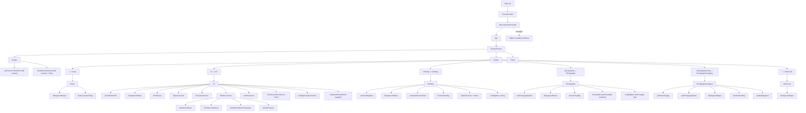

# `src/` for [danhenderson.dev](https://www.danhenderson.dev)

## Component structure

```mermaid
flowchart TD
  index["index.tsx"]
  theme["ThemeProvider"]
  audio["WelcomeAudioProvider"]
  app["App"]
  iframe["Hidden SoundCloud iframe"]

  index --> theme --> audio --> app
  audio -.manages.-> iframe

  app --> router["BrowserRouter"]
  router --> header["Header"]
  router --> routes["Routes"]
  router --> footer["Footer"]

  header --> headerTheme["useTheme (ThemeProvider context)"]
  header --> headerAudio["useWelcomeAudio (audio controls + hints)"]

  routes --> rHome["/ -> Home"]
  routes --> rCV["/cv -> CV"]
  routes --> rClimb["/climbing -> Climbing"]
  routes --> rPhoto["/photography -> Photography"]
  routes --> rPhotoCat["/photography/:slug -> PhotographyCategory"]
  routes --> r404["* -> NotFound"]

  rHome --> home["Home"]
  home --> homeBg["BackgroundPaper"]
  home --> homeDialog["Audio prompt Dialog"]

  rCV --> cv["CV"]
  cv --> cvData["useGithubProfile"]
  cv --> cvBg["BackgroundPaper"]
  cv --> cvAbout["ProfileCard"]
  cv --> cvExp["ExperienceList"]
  cv --> cvEdu["EducationSection"]
  cv --> cvGh["GitHub sections"]
  cv --> cvCert["CertificatesList"]
  cv --> cvTools["ToolsAccordion (Stack & Tools)"]
  cv --> cvCode["CodingExamplesSection"]
  cv --> cvAnim["AnimatedContentCard wrappers"]

  cvGh --> ghActivity["GitHubActivityList"]
  cvGh --> ghContrib["GitHubContributions"]
  cvGh --> ghCalendar["GitHubContributionCalendar"]
  cvGh --> ghProjects["GitHubProjects"]

  rClimb --> climbing["Climbing"]
  climbing --> climbData["useClimbingData"]
  climbing --> climbBg["BackgroundPaper"]
  climbing --> climbCard["AnimatedContentCard"]
  climbing --> climbHead["SectionHeading"]
  climbing --> climbGrid["DataGrid (ticks + todos)"]
  climbing --> climbLoad["LoadingBars overlay"]

  rPhoto --> photo["Photography"]
  photo --> photoData["usePhotographyData"]
  photo --> photoBg["BackgroundPaper"]
  photo --> photoHead["SectionHeading"]
  photo --> photoCards["AnimatedContentCard grid of albums"]
  photo --> photoLoad["LoadingBars while images load"]

  rPhotoCat --> photoCat["PhotographyCategory"]
  photoCat --> photoCatParams["useParams(slug)"]
  photoCat --> photoCatData["usePhotographyData"]
  photoCat --> photoCatBg["BackgroundPaper"]
  photoCat --> photoCatHead["SectionHeading"]
  photoCat --> photoAlbum["QuiltedImageList"]

  r404 --> notFound["NotFound"]
  notFound --> notFoundBg["BackgroundPaper"]
```
