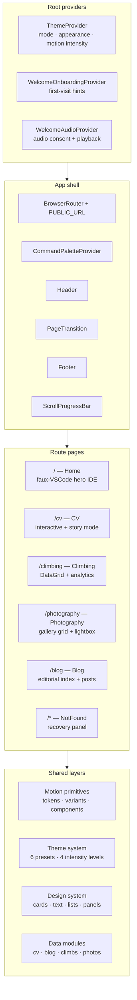

# Documentation

Architecture and implementation reference for [danhenderson.dev](https://danhenderson.dev), a motion-rich React + TypeScript portfolio application.

## Audiences

These docs serve three groups:

1. **Coding agents** — safe extension guidance, architectural invariants, and ownership boundaries to prevent drift
2. **Developers** — precise documentation of motion systems, page composition, theme/styling patterns, and shared primitives
3. **Reviewers / hiring managers** — evidence of deliberate frontend engineering, system design, and implementation maturity

## Instruction map

Repository instructions are layered. Use them in this order:

| Resource                                            | Owns                                                                         | When to use                                                                      |
| --------------------------------------------------- | ---------------------------------------------------------------------------- | -------------------------------------------------------------------------------- |
| [AGENTS.md](../AGENTS.md)                           | Repo-level workflow, guardrails, and instruction discovery                   | Before any cross-cutting or repo-wide task                                       |
| [Agent guide](engineering/agent-guide.md)           | Architecture invariants, intentional exceptions, and safe extension patterns | When making structural UI, motion, theme, styling, or route changes              |
| [Testing strategy](engineering/testing-strategy.md) | Validation matrix, build variants, and repo-standard command shapes          | Whenever validating a change                                                     |
| [PLANS.md](../PLANS.md)                             | ExecPlan triggers, requirements, and template                                | When a task is non-trivial, cross-cutting, or otherwise meets a planning trigger |
| `src/**/AGENTS.md` and `public/resume/AGENTS.md`    | Canonical local rules for the directory being edited                         | Before editing files in that scope                                               |
| `.github/instructions/*.instructions.md`            | Auto-applied shims that summarize the relevant scoped rules                  | When Copilot preloads file-matched instructions                                  |

If multiple documents overlap, prefer the canonical owner above and then the nearest scoped `AGENTS.md` for the files you are editing.

## Application at a glance

## Documentation map

### Project

| Document                                | Purpose                                                                 |
| --------------------------------------- | ----------------------------------------------------------------------- |
| [Project overview](project/overview.md) | What this site is, what makes it notable, and how the repo is organized |

### Architecture

| Document                                             | Purpose                                                                   |
| ---------------------------------------------------- | ------------------------------------------------------------------------- |
| [App architecture](architecture/app-architecture.md) | Application shell, route structure, providers, and page composition model |

### Frontend

| Document                                                     | Purpose                                                                                 |
| ------------------------------------------------------------ | --------------------------------------------------------------------------------------- |
| [Component architecture](frontend/component-architecture.md) | Shared primitives, feature components, ownership boundaries, and safe extension points  |
| [Motion architecture](frontend/motion-architecture.md)       | Motion token system, animation layers, choreography patterns, and intensity scaling     |
| [Theme and styling](frontend/theme-and-styling.md)           | MUI theme construction, appearance presets, style builders, and styling placement rules |
| [Page choreography](frontend/page-choreography.md)           | Route-by-route page assembly, entrance sequencing, and orchestration patterns           |

### Engineering

| Document                                            | Purpose                                                                                |
| --------------------------------------------------- | -------------------------------------------------------------------------------------- |
| [Testing strategy](engineering/testing-strategy.md) | Test organization, harness patterns, motion-specific testing, and coverage priorities  |
| [Agent guide](engineering/agent-guide.md)           | Operational rules, common failure modes, and safe extension patterns for coding agents |

### Reference

| Document                                              | Purpose                                                                                   |
| ----------------------------------------------------- | ----------------------------------------------------------------------------------------- |
| [Design system reference](design-system-reference.md) | Catalog of established UI patterns, shared surfaces, text primitives, and selection guide |

## Quick orientation

- **Adding a new page?** Start with [app architecture](architecture/app-architecture.md), then [page choreography](frontend/page-choreography.md).
- **Extending a component?** Start with [component architecture](frontend/component-architecture.md) and the [design system reference](design-system-reference.md).
- **Working with animations?** Start with [motion architecture](frontend/motion-architecture.md).
- **Changing theme or styling?** Start with [theme and styling](frontend/theme-and-styling.md).
- **Running or writing tests?** Start with [testing strategy](engineering/testing-strategy.md).
- **AI agent implementing features?** Start with the [agent guide](engineering/agent-guide.md) before touching code.
