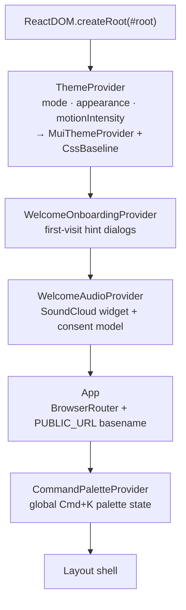
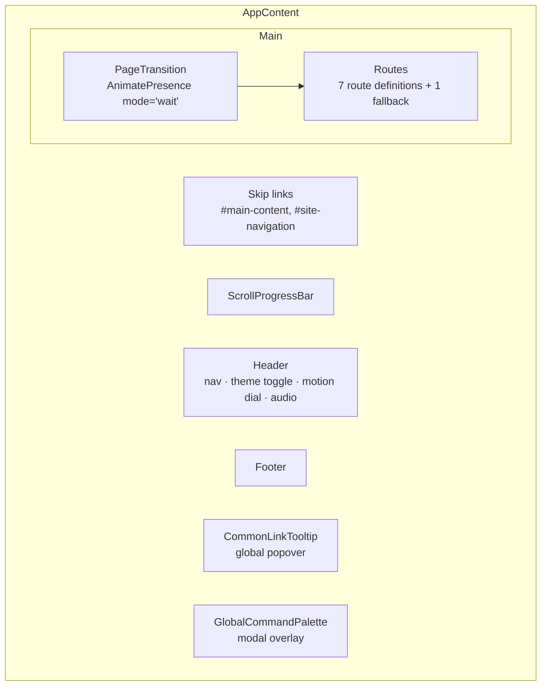
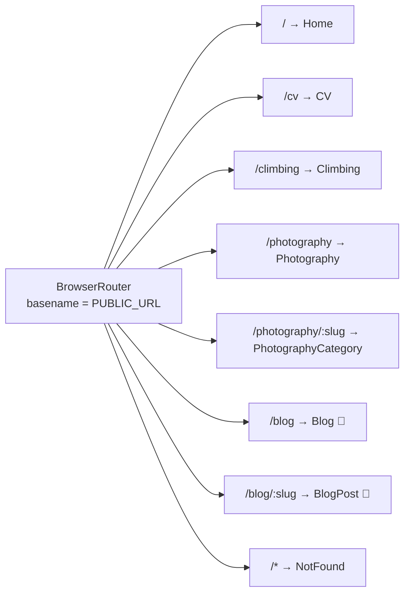
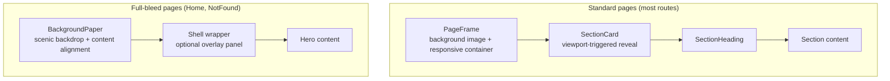
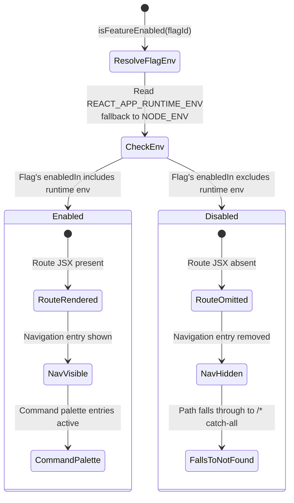
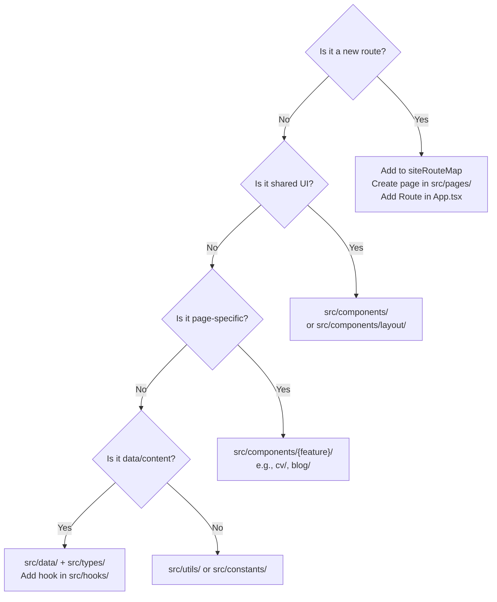

# App Architecture

This document covers the application shell, provider hierarchy, route structure, and page composition model.

## Provider nesting

Providers are ordered from outermost (root) to innermost (content):

### Provider responsibilities

| Provider                    | State                                                                                 | Persistence                           | Hook                     |
| --------------------------- | ------------------------------------------------------------------------------------- | ------------------------------------- | ------------------------ |
| `ThemeProvider`             | Palette mode (light/dark), appearance preset (6 options), motion intensity (4 levels) | Three independent `localStorage` keys | `useAppTheme()`          |
| `WelcomeOnboardingProvider` | Pause-motion hint, dark-mode hint                                                     | Session-scoped (no persistence)       | `useWelcomeOnboarding()` |
| `WelcomeAudioProvider`      | Audio consent (unknown/granted/declined), playback state, widget lifecycle            | `localStorage` consent key            | `useWelcomeAudio()`      |
| `CommandPaletteProvider`    | Open/close state, search query                                                        | None                                  | `useCommandPalette()`    |

**Key constraint:** `ThemeProvider` must remain outermost because all downstream providers and components depend on MUI's `ThemeProvider` for `useTheme()` access. `CommandPaletteProvider` wraps only `AppContent`, not the root — it doesn't need theme context consumers above it.

## Application shell

Inside `App`, the layout shell contains global chrome that persists across route transitions:

### Shell components

| Component              | Scope          | Purpose                                                                                                                    |
| ---------------------- | -------------- | -------------------------------------------------------------------------------------------------------------------------- |
| `ScrollProgressBar`    | Global         | Thin progress indicator at viewport top, driven by scroll position                                                         |
| `Header`               | Global         | Sticky app bar with primary navigation, theme/appearance toggles, motion intensity dial, audio controls, and mobile drawer |
| `PageTransition`       | Wraps `Routes` | Crossfade + slide-up on route change using `AnimatePresence mode="wait"` — respects motion intensity scaling               |
| `Footer`               | Global         | Site footer below all route content                                                                                        |
| `CommonLinkTooltip`    | Global         | Popper-based tooltip for external links across all pages                                                                   |
| `GlobalCommandPalette` | Global         | Cmd+K modal for site-wide search and navigation                                                                            |

## Route definitions

🏴 = feature-gated via `isFeatureEnabled('blog')` — enabled in development/test, disabled in production.

### Route metadata

Route definitions live in `src/constants/siteRoutes.ts` as `siteRouteMap`. Each route carries:

- `path`, `label`, `title`, `description` — used by navigation, SEO head tags, and command palette
- `image` — OG image reference
- `keywords` — SEO and command palette search targets
- `featureFlag` — optional gating (only `blog` currently)
- `showInPrimaryNav` — whether to show in header navigation
- `action` — command palette entry with `recoveryPriority` for not-found suggestions
- `status` — data source kind (static, remote with fallback)

Filtered exports:

- `siteRoutes` — all routes with active feature flags
- `primaryNavigationRoutes` — routes with `showInPrimaryNav: true`

## Page composition model

Every route page follows one of two scaffold patterns:

### `PageFrame` (standard scaffold)

Used by: Blog, BlogPost, CV, Climbing, Photography, PhotographyCategory

Provides:

- Full-viewport `BackgroundPaper` with configurable background image
- Responsive `Container` (MUI) with route-specific max-width and padding
- Automatic `useDocumentMetadata()` call for SEO

### `BackgroundPaper` (full-bleed scaffold)

Used by: Home, NotFound

Provides:

- Full-height scenic image backdrop with `::before` overlay
- Optional `shellWrapper` render prop for placing content panels over the image
- Content alignment (centered or custom)

### Page-level statefulness

Pages own orchestration state. Shared components are intentionally stateless or accept controlled props:

| Concern                       | Owned by                                   | Not owned by                           |
| ----------------------------- | ------------------------------------------ | -------------------------------------- |
| Section visibility sequencing | Page (via layout metadata + `delayMs`)     | Shared components                      |
| Tab/accordion expanded state  | Feature component (e.g., `ExperienceList`) | Page                                   |
| Story mode navigation         | `CVStoryViewer`                            | `CV.tsx` (delegates)                   |
| IDE window state              | `Home.tsx` (drag/resize/expand)            | `TerminalHeroContent` (receives props) |
| Audio prompt flow             | `useHomeWelcomeSequence()` hook            | Page (consumes)                        |
| Search/filter state           | Page-local state                           | Data hooks (return full datasets)      |

## Feature gating

`src/constants/featureFlags.ts` provides the feature flag system:

Currently only `blog` is feature-gated. Blog routes, navigation entries, and command palette actions are fully removed when the flag is off.

## Cross-cutting concerns

| Concern            | Implementation                                                     | Location                                          |
| ------------------ | ------------------------------------------------------------------ | ------------------------------------------------- |
| SPA routing        | Host must rewrite unknown paths to `index.html`                    | `BrowserRouter` with `PUBLIC_URL` basename        |
| SEO metadata       | `useDocumentMetadata()` sets title, description, OG tags per route | `src/hooks/useDocumentMetadata.ts`                |
| Accessibility      | Skip links, keyboard-navigable tab panels, ARIA roles              | App shell + `TabPanel` + components               |
| Error recovery     | `RouteRecoveryPanel` with contextual route suggestions             | NotFound page + blog/photography not-found states |
| GitHub degradation | `useGithubProfile()` falls back to bundled data on API failure     | `src/hooks/useGithubProfile.ts`                   |
| Static assets      | `PUBLIC_URL`-compatible paths via `src/utils/assets.ts`            | All image/PDF references                          |

## Where new features should go

## Further reading

- [Component architecture](../frontend/component-architecture.md) — how shared and feature components are organized
- [Page choreography](../frontend/page-choreography.md) — route-by-route assembly patterns
- [Motion architecture](../frontend/motion-architecture.md) — how PageTransition and motion scaling work
- [Agent guide](../engineering/agent-guide.md) — operational rules for safe feature extension
