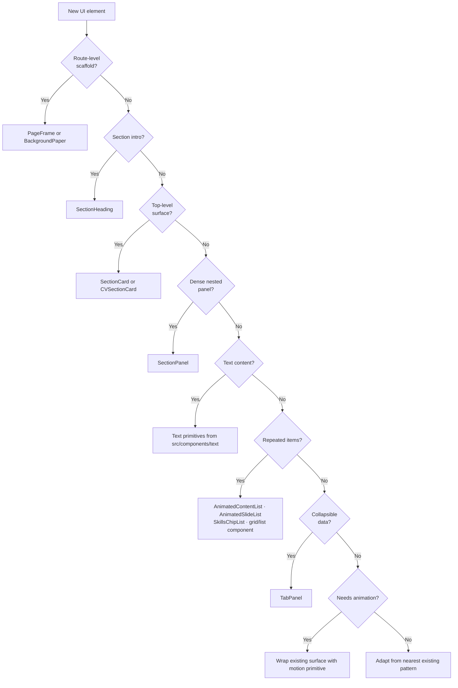

# Design System Reference

## Non-negotiable rules

1. **All UI copy must use `Text` (semantic roles) or a composition primitive that uses `Text` internally.**
2. **Direct MUI `Typography` imports are banned outside `src/components/text/**`.** Enforced by ESLint `no-restricted-imports`.
3. **Blog and photography are not design-system exceptions.** Blog uses prose context. Photography uses inverse-tone overlay context.
4. **When a text role is missing, add it to the typeset registry** — do not work around the system with local `sx` overrides.

## Text authoring decision tree

- **UI chrome** (nav, button labels, chips) → `Text role="label"` or `InlineLabel` primitives
- **Structural UI** (section/card headings, meta, body) → `Text role="..."` with the appropriate role
- **Long-form reading** (blog articles) → `Text` with prose roles (`proseParagraph`, `proseHeading`, etc.)
- **Text on imagery** (photography overlays) → `Text tone="inverse" context="overlay"` with the appropriate role
- **Exception boundary** (IDE hero, CV story mode) → `UnsafeTypography` with required `_unsafe` metadata

## How to extend roles and typesets

When a needed role does not exist:

1. Add the role to the `TextRole` union in `src/types/text.ts`
2. Add the typeset definition in `src/styles/textStyleBuilders.ts`
3. Add a default semantic element mapping in `src/components/text/Text.tsx`
4. Update the role table in this document
5. Add at least one usage example

## Enforcement mechanisms

- **ESLint `no-restricted-imports`**: Blocks `@mui/material/Typography` and `Typography` barrel import from `@mui/material`. Override only in `src/components/text/**`.
- **`UnsafeTypography` wrapper**: Requires `_unsafe` metadata with `reason`, `owner`, and `expiresBy`. Only used in explicitly sanctioned exception modules.
- **Typeset builder**: Typography styling is centralized in `src/styles/textStyleBuilders.ts`, not in ad-hoc `sx` on text consumers.

---

This is the concrete catalog of established UI surfaces, primitives, and patterns. Before introducing a new pattern, start with the existing foundations below and adapt the narrowest existing layer that fits.

For architecture-level context, see [Component architecture](frontend/component-architecture.md) and [Theme and styling](frontend/theme-and-styling.md).

## Core Rules

- Prefer shared route scaffolds before page-local layout.
- Prefer semantic text primitives before styling raw `Typography`.
- Prefer shared card and panel surfaces before inventing a new container.
- Prefer `Stack`, shared gap helpers, and shared padding profiles before ad hoc spacing.
- Prefer the existing animated list and chip-list primitives for repeated content.
- Treat the Home IDE hero as an intentional design-system exception; CV story mode is a bounded exception via `UnsafeTypography`.

## Foundations

| Area                    | Preferred pattern                                                                | Primary source                                                                  |
| ----------------------- | -------------------------------------------------------------------------------- | ------------------------------------------------------------------------------- |
| Theme                   | Responsive type scale, palette, rounded surfaces, chip and button defaults       | [src/theme/createAppTheme.ts](../src/theme/createAppTheme.ts)                   |
| Appearance presets      | Body and heading font families, surface treatments, motion scaling               | [src/theme/appAppearance.ts](../src/theme/appAppearance.ts)                     |
| Shared component styles | Card, panel, chip, tab, list, and CV-specific surface styling                    | [src/styles/componentStyleBuilders.ts](../src/styles/componentStyleBuilders.ts) |
| Shared page styles      | Route container spacing, backdrop shells, photography, CV, and DataGrid wrappers | [src/styles/appStyleBuilders.ts](../src/styles/appStyleBuilders.ts)             |

## Typography

### 1. Semantic text primitives

Use purpose-named text wrappers instead of styling raw `Typography` when the copy matches an existing semantic role.

- Section labels and titles: `HeaderLabel`, `HeaderTitle`, `HeaderSubtitle`
- Entry and metadata text: `EntryTitle`, `MetaText`, `StrongMetaText`, `BodyText`, `CaptionText`
- Dashboard/stat values: `MetricValueText`
- Secondary copy: `SecondaryBodyText`, `SecondaryCaptionText`
- List copy: `ListItemText`

Defined in [src/components/text/TypographyPrimitives.tsx](../src/components/text/TypographyPrimitives.tsx).

Common consumers:

- [src/components/layout/SectionHeading.tsx](../src/components/layout/SectionHeading.tsx)
- [src/components/cv/CVEntryHeader.tsx](../src/components/cv/CVEntryHeader.tsx)
- [src/components/cv/ProfileCard.tsx](../src/components/cv/ProfileCard.tsx)
- [src/components/climbing/ClimbingAnalytics.tsx](../src/components/climbing/ClimbingAnalytics.tsx) for metric dashboards
- [src/components/photography/AlbumCard.tsx](../src/components/photography/AlbumCard.tsx)

### 2. Inline label primitives

For tabs, chips, and compact controls, use the span-based label primitives so labels inherit surrounding typography cleanly.

Defined in [src/components/text/InlineLabelPrimitives.tsx](../src/components/text/InlineLabelPrimitives.tsx).

Common consumers:

- [src/components/AppSpeedDial.tsx](../src/components/AppSpeedDial.tsx)
- [src/components/TabPanel.tsx](../src/components/TabPanel.tsx)
- [src/components/SkillsChipList.tsx](../src/components/SkillsChipList.tsx)
- [src/components/cv/GitHubLinkChipList.tsx](../src/components/cv/GitHubLinkChipList.tsx)

### 3. `Text` component — canonical text authoring API

All UI text is authored through the `Text` component using semantic `role`, `tone`, and `context` props. The typeset builder in `src/styles/textStyleBuilders.ts` maps role×tone×context to styled output. Direct MUI `Typography` imports are banned outside `src/components/text/**` (enforced by ESLint).

Defined in [src/components/text/Text.tsx](../src/components/text/Text.tsx). Shared types in [src/types/text.ts](../src/types/text.ts).

**Blog** uses prose roles (`proseParagraph`, `proseHeading`, etc.) via `Text` — not a separate editorial typography system.

**Photography overlays** use `Text tone="inverse" context="overlay"` — not local `sx` overrides on raw `Typography`.

**Escape hatch:** `UnsafeTypography` in [src/components/text/UNSAFE_Typography.tsx](../src/components/text/UNSAFE_Typography.tsx) requires `_unsafe` metadata (`reason`, `owner`, `expiresBy`). Used only in explicitly sanctioned exception modules (IDE hero, CV story mode).

Common consumers:

- [src/components/blog/BlogHero.tsx](../src/components/blog/BlogHero.tsx)
- [src/components/blog/BlogArticleHeader.tsx](../src/components/blog/BlogArticleHeader.tsx)
- [src/components/blog/BlogArticleBody.tsx](../src/components/blog/BlogArticleBody.tsx)
- [src/components/photography/AlbumCard.tsx](../src/components/photography/AlbumCard.tsx)
- [src/components/photography/AlbumLocationSummary.tsx](../src/components/photography/AlbumLocationSummary.tsx)
- [src/pages/PhotographyCategory.tsx](../src/pages/PhotographyCategory.tsx)
- [src/components/photography/ImmersiveLightbox.tsx](../src/components/photography/ImmersiveLightbox.tsx)

## Spacing

### 1. Page-frame spacing

Most route pages should live inside `PageFrame`, which provides the standard centered container and responsive route padding.

Defined in [src/components/layout/PageFrame.tsx](../src/components/layout/PageFrame.tsx) and [src/styles/appStyleBuilders.ts](../src/styles/appStyleBuilders.ts).

Common consumers:

- [src/pages/Blog.tsx](../src/pages/Blog.tsx)
- [src/pages/BlogPost.tsx](../src/pages/BlogPost.tsx)
- [src/pages/Photography.tsx](../src/pages/Photography.tsx)
- [src/pages/PhotographyCategory.tsx](../src/pages/PhotographyCategory.tsx)
- [src/pages/Climbing.tsx](../src/pages/Climbing.tsx)
- [src/pages/CV.tsx](../src/pages/CV.tsx)

### 2. Stack-driven vertical rhythm

Prefer `Stack` spacing for vertical composition. Repeated values already cluster around a few stable rhythms.

- Major section spacing: `2.5` to `3.5`
- Local content grouping: `1` to `2`
- Compact metadata and chip rows: `0.5` to `0.75`

Common consumers:

- [src/pages/Blog.tsx](../src/pages/Blog.tsx)
- [src/pages/BlogPost.tsx](../src/pages/BlogPost.tsx)
- [src/components/cv/CVSectionStack.tsx](../src/components/cv/CVSectionStack.tsx)
- [src/components/cv/ProfileCard.tsx](../src/components/cv/ProfileCard.tsx)

### 3. Shared padding and gap profiles

Prefer existing shared padding and gap profiles over inventing a new card inset or wrap gap.

Primary sources:

- [src/styles/componentStyleBuilders.ts](../src/styles/componentStyleBuilders.ts)
- [src/styles/appStyleBuilders.ts](../src/styles/appStyleBuilders.ts)

Useful examples:

- `contentCardSx` and `contentCardInsetSx`
- `skillsWrapSx`
- `getWrapListSx`
- `getDetailListSx`

## Cards

### 1. `ContentCard`

This is the base reusable frosted card surface: rounded corners, gradient-backed panel treatment, border, blur, and shared shadow.

Defined in [src/components/ContentCard.tsx](../src/components/ContentCard.tsx).

Common consumers:

- [src/components/blog/BlogHero.tsx](../src/components/blog/BlogHero.tsx)
- [src/components/blog/BlogPostCard.tsx](../src/components/blog/BlogPostCard.tsx)
- [src/components/blog/BlogRelatedPosts.tsx](../src/components/blog/BlogRelatedPosts.tsx)
- [src/components/blog/BlogCodeBlock.tsx](../src/components/blog/BlogCodeBlock.tsx)
- [src/components/cv/GitHubContributions.tsx](../src/components/cv/GitHubContributions.tsx)
- [src/components/cv/GitHubContributionCalendar.tsx](../src/components/cv/GitHubContributionCalendar.tsx)

### 2. `SectionCard`

Use for standard route sections and standalone content blocks that should reveal with the default card entrance animation.

Defined in [src/components/layout/SectionCard.tsx](../src/components/layout/SectionCard.tsx) via [src/components/AnimatedContentCard.tsx](../src/components/AnimatedContentCard.tsx).

Common consumers:

- [src/pages/Blog.tsx](../src/pages/Blog.tsx)
- [src/pages/BlogPost.tsx](../src/pages/BlogPost.tsx)
- [src/pages/Photography.tsx](../src/pages/Photography.tsx)
- [src/pages/PhotographyCategory.tsx](../src/pages/PhotographyCategory.tsx)
- [src/pages/Climbing.tsx](../src/pages/Climbing.tsx)

### 3. `CVSectionCard`

Use for top-level `/cv` sections. It extends `SectionCard` with the more decorative CV-specific surface treatment.

Defined in [src/components/cv/CVSectionCard.tsx](../src/components/cv/CVSectionCard.tsx).

Common consumers:

- [src/components/cv/CVAboutSection.tsx](../src/components/cv/CVAboutSection.tsx)
- [src/components/cv/CVExperienceSection.tsx](../src/components/cv/CVExperienceSection.tsx)
- [src/components/cv/CVEducationSection.tsx](../src/components/cv/CVEducationSection.tsx)
- [src/components/cv/CVCertificatesSection.tsx](../src/components/cv/CVCertificatesSection.tsx)
- [src/components/cv/CVCodingSection.tsx](../src/components/cv/CVCodingSection.tsx)
- [src/components/cv/CVVolunteeringSection.tsx](../src/components/cv/CVVolunteeringSection.tsx)
- [src/components/cv/CVGitHubSection.tsx](../src/components/cv/CVGitHubSection.tsx)

### 4. `SectionPanel`

Use for nested dense data inside a larger card. This is the flatter inset panel, not a top-level section surface.

Defined in [src/components/layout/SectionPanel.tsx](../src/components/layout/SectionPanel.tsx).

Common consumers:

- [src/components/climbing/ClimbingAnalytics.tsx](../src/components/climbing/ClimbingAnalytics.tsx)
- [src/components/cv/CVGitHubSection.tsx](../src/components/cv/CVGitHubSection.tsx)
- Panel mode in [src/components/AnimatedContentList.tsx](../src/components/AnimatedContentList.tsx)

### 5. Intentional card exceptions

- Image-first overlay cards: [src/components/photography/AlbumCard.tsx](../src/components/photography/AlbumCard.tsx)
- Full-bleed media gallery items: [src/components/PhotoAlbum.tsx](../src/components/PhotoAlbum.tsx)
- Faux IDE shell: [src/components/TerminalHeroContent.tsx](../src/components/TerminalHeroContent.tsx)

## Section Containers

### 1. `BackgroundPaper`

Use for full-height scenic backdrops with content alignment and optional shell treatment.

Defined in [src/components/BackgroundPaper.tsx](../src/components/BackgroundPaper.tsx).

Primary consumers:

- [src/pages/Home.tsx](../src/pages/Home.tsx)
- [src/pages/NotFound.tsx](../src/pages/NotFound.tsx)
- Wrapper used by [src/components/layout/PageFrame.tsx](../src/components/layout/PageFrame.tsx)

### 2. `PageFrame`

Use for standard content routes that should sit inside the site’s shared scenic backdrop and constrained container.

Defined in [src/components/layout/PageFrame.tsx](../src/components/layout/PageFrame.tsx).

### 3. `SectionHeading`

Use for standard section intros. It composes the existing text primitives instead of asking each page to build its own overline/title/subtitle stack.

Defined in [src/components/layout/SectionHeading.tsx](../src/components/layout/SectionHeading.tsx).

Common consumers:

- [src/pages/Blog.tsx](../src/pages/Blog.tsx)
- [src/pages/Photography.tsx](../src/pages/Photography.tsx)
- [src/pages/Climbing.tsx](../src/pages/Climbing.tsx)
- `/cv` section wrappers under [src/components/cv](../src/components/cv)

### 4. `CVSectionStack`

Use for vertical stacks of top-level CV sections inside each desktop or mobile region.

Defined in [src/components/cv/CVSectionStack.tsx](../src/components/cv/CVSectionStack.tsx).

Primary consumer:

- [src/pages/CV.tsx](../src/pages/CV.tsx)

## Lists

### 1. `AnimatedContentList`

Preferred pattern for repeated CV content blocks. Supports stack or wrap layout and card, panel, or plain item surfaces.

Defined in [src/components/AnimatedContentList.tsx](../src/components/AnimatedContentList.tsx).

Primary consumers:

- [src/components/cv/ExperienceList.tsx](../src/components/cv/ExperienceList.tsx)
- [src/components/cv/EducationSection.tsx](../src/components/cv/EducationSection.tsx)
- [src/components/cv/CertificatesList.tsx](../src/components/cv/CertificatesList.tsx)
- [src/components/cv/CodingExamplesSection.tsx](../src/components/cv/CodingExamplesSection.tsx)
- [src/components/cv/VolunteeringList.tsx](../src/components/cv/VolunteeringList.tsx)

### 2. `AnimatedSlideList`

Preferred pattern for supplemental detail lists inside tabs and chip drawers.

Defined in [src/components/AnimatedSlideList.tsx](../src/components/AnimatedSlideList.tsx).

Primary consumers:

- [src/components/cv/ExperienceList.tsx](../src/components/cv/ExperienceList.tsx)
- [src/components/cv/EducationSection.tsx](../src/components/cv/EducationSection.tsx)
- [src/components/cv/CodingExamplesSection.tsx](../src/components/cv/CodingExamplesSection.tsx)
- [src/components/cv/VolunteeringList.tsx](../src/components/cv/VolunteeringList.tsx)

### 3. `SkillsChipList`

Preferred pattern for skill, tool, and opportunity chips.

Defined in [src/components/SkillsChipList.tsx](../src/components/SkillsChipList.tsx).

Primary consumers:

- [src/components/cv/CVAboutSection.tsx](../src/components/cv/CVAboutSection.tsx)
- [src/components/cv/ExperienceList.tsx](../src/components/cv/ExperienceList.tsx)
- [src/components/cv/EducationSection.tsx](../src/components/cv/EducationSection.tsx)
- [src/components/cv/CodingExamplesSection.tsx](../src/components/cv/CodingExamplesSection.tsx)
- [src/components/cv/CVStorySectionRenderer.tsx](../src/components/cv/CVStorySectionRenderer.tsx)

### 4. Grid and media lists

- Blog post card grid: [src/components/blog/BlogPostList.tsx](../src/components/blog/BlogPostList.tsx)
- Photography quilted image list: [src/components/PhotoAlbum.tsx](../src/components/PhotoAlbum.tsx)
- Command results list: [src/components/GlobalCommandPalette.tsx](../src/components/GlobalCommandPalette.tsx)

## Data Display

### 1. `TabPanel`

Preferred pattern for dense supplemental data that should stay collapsible and keyboard-navigable.

Defined in [src/components/TabPanel.tsx](../src/components/TabPanel.tsx).

Primary consumers:

- [src/components/cv/ExperienceList.tsx](../src/components/cv/ExperienceList.tsx)
- [src/components/cv/EducationSection.tsx](../src/components/cv/EducationSection.tsx)
- [src/components/cv/CodingExamplesSection.tsx](../src/components/cv/CodingExamplesSection.tsx)
- [src/components/cv/VolunteeringList.tsx](../src/components/cv/VolunteeringList.tsx)

### 2. Structured data and analytics surfaces

- Searchable route tables with `DataGrid`: [src/pages/Climbing.tsx](../src/pages/Climbing.tsx)
- Analytics dashboard panels: [src/components/climbing/ClimbingAnalytics.tsx](../src/components/climbing/ClimbingAnalytics.tsx)
- GitHub activity chips, contributions, and calendar: [src/components/cv/CVGitHubSection.tsx](../src/components/cv/CVGitHubSection.tsx)

### 3. Editorial content renderer

Blog content is displayed through typed content blocks, not page-local ad hoc markup.

Primary files:

- [src/components/blog/BlogArticleBody.tsx](../src/components/blog/BlogArticleBody.tsx)
- [src/components/blog/BlogCodeBlock.tsx](../src/components/blog/BlogCodeBlock.tsx)
- [src/components/blog/BlogCallout.tsx](../src/components/blog/BlogCallout.tsx)
- [src/components/blog/BlogBlockquote.tsx](../src/components/blog/BlogBlockquote.tsx)

### 4. Recovery and utility panels

- Route recovery surface: [src/components/RouteRecoveryPanel.tsx](../src/components/RouteRecoveryPanel.tsx)
- Performance and build-info dialog: [src/components/PerformanceScorecard.tsx](../src/components/PerformanceScorecard.tsx)

## Motion and Interaction Wrappers

Use these as wrappers around existing surfaces, not as substitutes for them.

- Hover and tap card wrapper: `MotionCard` in [src/motion/components.tsx](../src/motion/components.tsx)
- Pointer-follow tilt wrapper: `MotionTiltCard` in [src/motion/components.tsx](../src/motion/components.tsx)
- Scroll-triggered section wrappers: `MotionSection`, `MotionFadeIn`, and `MotionScaleIn` under [src/motion](../src/motion)

Common consumers:

- [src/components/blog/BlogPostCard.tsx](../src/components/blog/BlogPostCard.tsx)
- [src/components/blog/BlogArticleNav.tsx](../src/components/blog/BlogArticleNav.tsx)
- [src/pages/Photography.tsx](../src/pages/Photography.tsx)
- [src/components/PhotoAlbum.tsx](../src/components/PhotoAlbum.tsx)
- [src/pages/Home.tsx](../src/pages/Home.tsx)

## Selection Guide

When adding or changing UI, prefer this order:

Priority order:

1. Route scaffold: `PageFrame` or `BackgroundPaper`
2. Section intro: `SectionHeading`
3. Top-level surface: `SectionCard` or `CVSectionCard`
4. Nested dense surface: `SectionPanel`
5. Text: primitives from `src/components/text`
6. Repeated items: `AnimatedContentList`, `AnimatedSlideList`, `SkillsChipList`, or an existing grid/list component
7. Data-heavy disclosure: `TabPanel`
8. Motion: wrap the existing surface with a motion primitive only if that pattern already exists nearby

If the UI you want does not fit one of the intentional exceptions above, it should usually be adapted from one of these existing patterns instead of introduced as a new one.

## Further reading

- [Component architecture](frontend/component-architecture.md) — layering, ownership boundaries, composition rules
- [Theme and styling](frontend/theme-and-styling.md) — style builder system and surface tokens
- [Motion architecture](frontend/motion-architecture.md) — animation primitives and intensity scaling
- [Page choreography](frontend/page-choreography.md) — how each route assembles these primitives
- [Agent guide](engineering/agent-guide.md) — decision trees for where to place new components and styles
