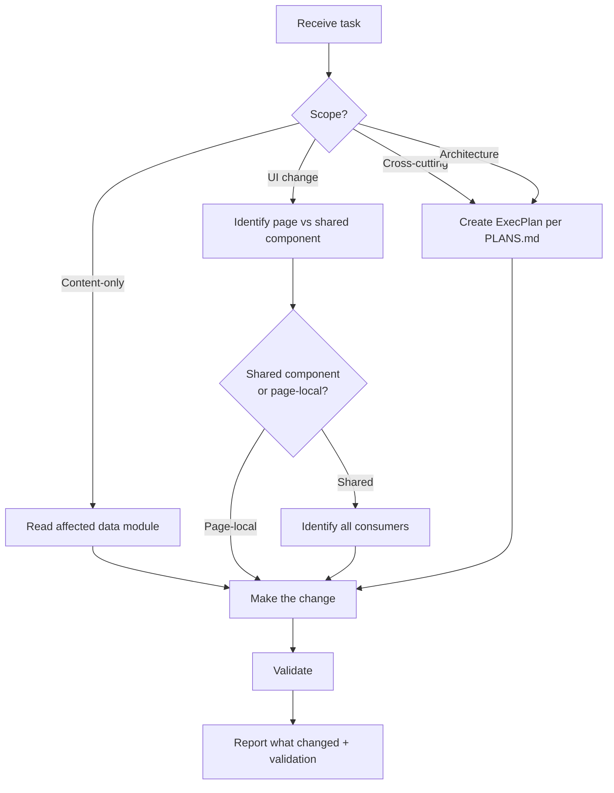
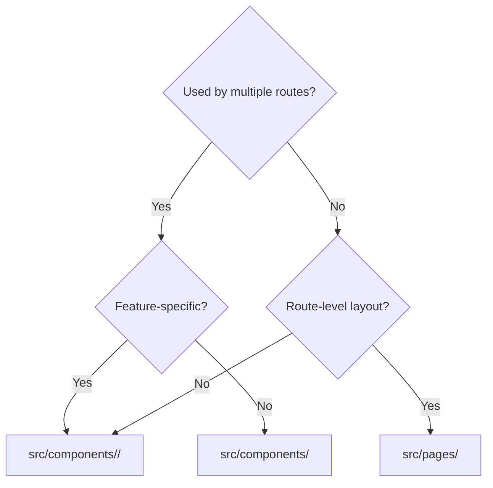
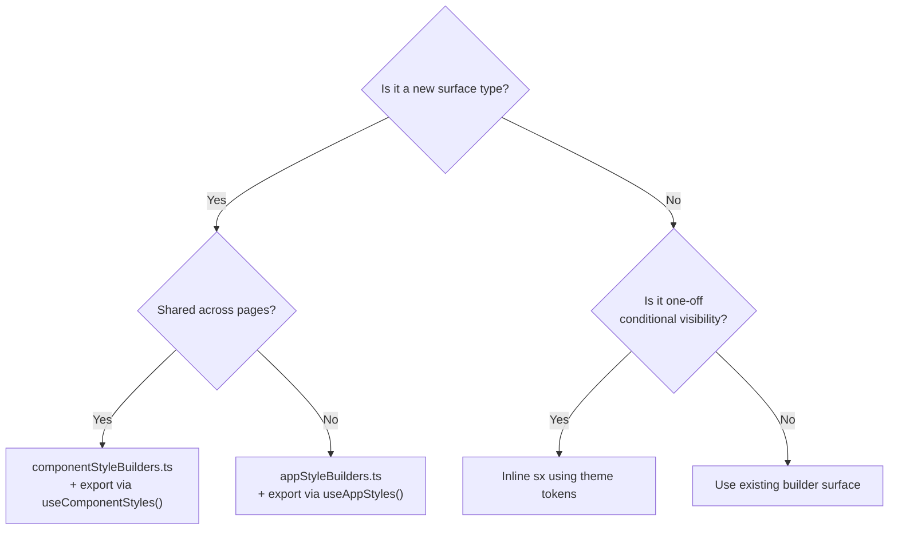
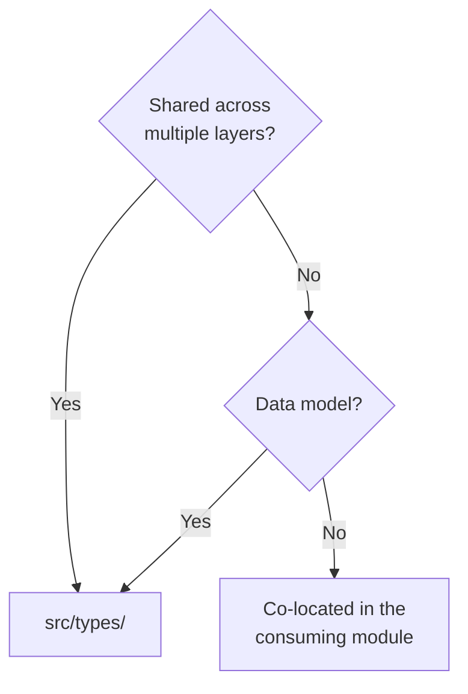

# Agent Guide

Operational rules, failure modes, and safe extension patterns for coding agents working in this repository.

This guide supplements the root [`AGENTS.md`](../../AGENTS.md) and nested `AGENTS.md` files with architecture-informed guidance. It is the canonical source for repository-wide architecture invariants and safe extension patterns. For validation matrices, build variants, and repo-standard command shapes, use [Testing strategy](testing-strategy.md). When rules conflict, prioritize the nearest `AGENTS.md` to the file being changed.

## Before you start



### Scope assessment checklist

Before editing any file:

1. Is this a content update (data module only) or a UI/behavior change?
2. Does the change affect a shared component? If yes, identify all consumers.
3. Does it touch motion, theme, or styling infrastructure? If yes, verify intensity scaling is preserved.
4. Does it span more than 3 source files? If yes, consider an ExecPlan.

## Architecture invariants

These are the non-negotiable rules. Breaking any of these produces a regression.

### 1. Provider nesting order

```
ThemeProvider → WelcomeOnboardingProvider → WelcomeAudioProvider → BrowserRouter → CommandPaletteProvider → AppContent
```

Do not rearrange providers. Each depends on context from its parent.

### 2. Motion intensity contract

All Framer Motion animation durations and delays must flow through `useMotionScale()`. When `motionIntensity` is `off`:

- All entrance animations must complete instantly (duration: 0)
- All stagger delays must be 0
- All CSS decorative animations must be disabled (`cssAnimations: false`)
- `prefers-reduced-motion: reduce` must force the `off` level

### 3. Style builder pipeline

Theme-conditional styles must come from `createComponentStyleMap()` or `createAppStyleMap()`, not from inline `sx` objects that read `theme.appearanceTreatment` directly. The style builders are memoized; bypassing them creates redundant computation and risks inconsistency.

### 4. Data modules are source of truth

Never generate content procedurally or fetch it from APIs (except GitHub profile data, which has explicit fallback handling). All portfolio, climbing, photography, and blog content lives in `src/data/`.

### 5. SPA routing and PUBLIC_URL

All routes are client-side. Direct links to any route must work when the host rewrites unknown paths to `index.html`. Asset URLs must use `PUBLIC_URL` for static hosting compatibility.

### 6. Feature gating

Feature-gated routes (currently: blog) must check `isFeatureEnabled()` from `src/constants/featureFlags.ts`. Never expose gated content unconditionally.

## Decision trees

### Where does this component go?



### Where does this style go?



### Where does this type go?



## Common failure modes

### 1. Broken motion handoffs

**Symptom:** Page sections never appear, or the home hero freezes mid-animation.

**Cause:** Changing an `onAnimationComplete` callback, motion variant, or `AnimatePresence` mode without understanding the sequence chain.

**Prevention:** Read the entrance sequence in [Page choreography](../frontend/page-choreography.md) before touching motion code. Test with motion intensity set to `off` to verify content renders without animation.

### 2. Theme drift

**Symptom:** A component looks correct with one appearance preset but breaks on another.

**Cause:** Hardcoded hex colors, custom font sizes, or spacing values that bypass theme tokens.

**Prevention:** Always use `theme.palette.*`, `theme.typography.*`, `theme.spacing()`, or style builder surfaces. Never hardcode colors or sizes.

### 3. AnimatedContentList composition breakage

**Symptom:** CV card items reveal all at once instead of staggering, or hidden cards become visible prematurely.

**Cause:** `tiltItems` changes the composition model — when enabled, each item must reveal independently via `AnimatedContentCard`/`MotionTiltCard`, not from a shared stagger container.

**Prevention:** Don't change `AnimatedContentList`'s render paths without checking both `tiltItems: true` and `tiltItems: false` behavior.

### 4. Style builder staleness

**Symptom:** A new style shows up in one preset/mode but not another.

**Cause:** Reading `theme.appearanceTreatment` in a component instead of adding the style to the appropriate builder module.

**Prevention:** Add new theme-conditional styles to `componentStyleBuilders.ts` or `appStyleBuilders.ts`. The hooks automatically memoize and update when the theme changes.

### 5. Feature flag leaks

**Symptom:** Blog content appears in production build.

**Cause:** Rendering blog routes without checking `isFeatureEnabled('blog')`.

**Prevention:** Any route or navigation link to gated content must check the feature flag.

### 6. GitHub API in dev/test

**Symptom:** CV page makes live GitHub API calls in development, causing rate-limiting or stale data.

**Cause:** Not respecting the `REACT_APP_ENABLE_GITHUB_API_IN_DEV` guard.

**Prevention:** GitHub API calls are skipped outside production by default. Don't bypass this unless you understand the implications.

## Intentional exceptions

Two subsystems intentionally deviate from the shared design system. Do not "fix" these:

| Subsystem       | Where                            | Why it's different                                                                             |
| --------------- | -------------------------------- | ---------------------------------------------------------------------------------------------- |
| IDE hero chrome | `src/components/ide/`            | Must look like VS Code, not like the portfolio                                                 |
| CV story mode   | `src/components/cv/CVStory*.tsx` | Full-screen immersive experience with its own motion system; bounded through `UnsafeTypography` |

Blog uses prose context via `Text` roles and is **not** a design-system exception. Photography uses inverse-tone overlay context via `Text` and is **not** a design-system exception.

## Validation handoff

[Testing strategy](testing-strategy.md) is the canonical source for validation commands, build variants, browser-validation expectations, and the repo-wide validation matrix. Use it whenever root or scoped instructions tell you to validate a change.

Architecture-specific reminders:

| Change area           | Additional check                                                                                 |
| --------------------- | ------------------------------------------------------------------------------------------------ |
| Motion/animation      | Verify motion intensity `off` and reduced-motion handling collapse entrance and stagger behavior |
| Theme/styling         | Validate both light/dark modes and at least two appearance presets when shared styling changes   |
| Shared component      | Validate a primary consumer and at least one additional clear consumer                           |
| Feature-gated content | Use `npm run build:e2e` and verify the gate still hides content outside enabled environments     |

## Safe extension patterns

### Adding a new CV section

1. Add section data to `src/data/cv.ts`
2. Add section key to `CVSectionKey` in `src/components/cv/cvSectionMetadata.ts`
3. Add layout placement to `cvPageSectionLayout` in `src/pages/cvPageLayout.ts`
4. Create section component in `src/components/cv/`
5. Register in the CV page's section renderer

### Adding a new route

1. Add route path to `src/constants/siteRoutes.ts`
2. Add route definition in `src/App.tsx`
3. Create page component in `src/pages/`
4. Add navigation entry to header/command palette as needed
5. If feature-gated, wrap in `isFeatureEnabled()` check

### Adding a new appearance preset

1. Add preset definition to `APP_APPEARANCES` in `src/theme/appAppearance.ts`
2. Define light + dark palettes, typography fonts, surface treatments, and motion treatment
3. Add to the appearance switcher UI
4. Test across all 6 routes with both light and dark modes

### Adding animation to a component

1. Import from `src/motion/components.tsx` (don't create new animated primitives)
2. Use existing variants from `src/motion/variants.ts` or define local variants that respect `useMotionScale()`
3. Duration tokens must come from `src/motion/tokens.ts` and scale with `motionScale.durationFactor`
4. Test with motion intensity `off` to verify the component functions without animation

## File ownership boundaries

| Area        | Data source              | Hook                   | Page                                  | Components                 |
| ----------- | ------------------------ | ---------------------- | ------------------------------------- | -------------------------- |
| CV          | `data/cv.ts`             | `useCVSectionData()`   | `pages/CV.tsx`                        | `components/cv/*`          |
| Climbing    | `data/climbs.ts`         | `useClimbingData()`    | `pages/Climbing.tsx`                  | `components/climbing/*`    |
| Photography | `data/photography.ts`    | `usePhotographyData()` | `pages/Photography.tsx`               | `components/photography/*` |
| Blog        | `data/blog.ts`           | `useBlogData()`        | `pages/Blog.tsx` `pages/BlogPost.tsx` | `components/blog/*`        |
| Theme       | `theme/appAppearance.ts` | `useTheme()`           | —                                     | `ThemeProvider.tsx`        |
| Motion      | `motion/tokens.ts`       | `useMotionScale()`     | —                                     | `motion/components.tsx`    |

## Further reading

- [Testing strategy](testing-strategy.md) — test patterns and validation commands
- [App architecture](../architecture/app-architecture.md) — provider hierarchy, route structure
- [Component architecture](../frontend/component-architecture.md) — ownership boundaries and composition rules
- [Motion architecture](../frontend/motion-architecture.md) — intensity scaling and anti-patterns
- [Theme and styling](../frontend/theme-and-styling.md) — style builder system and placement rules
- [Page choreography](../frontend/page-choreography.md) — route-level assembly and sequencing
