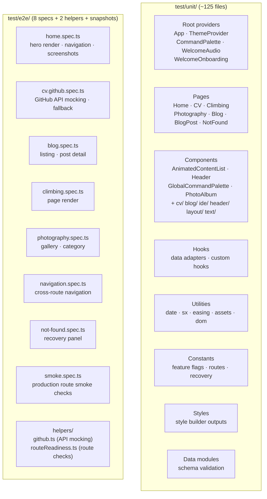
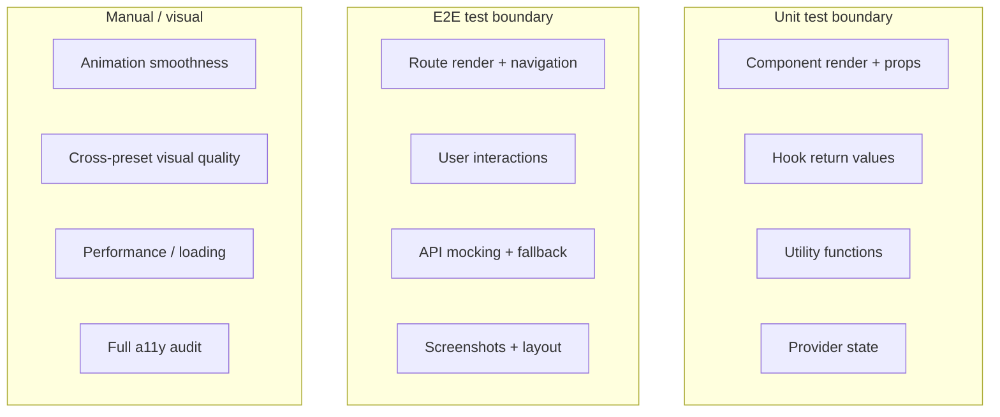

# Testing Strategy

This document covers the actual test organization, harness patterns, and coverage priorities in this repository.

## Test infrastructure

| Layer              | Framework                         | Location     | Run command                         |
| ------------------ | --------------------------------- | ------------ | ----------------------------------- |
| Unit / component   | Jest + React Testing Library      | `test/unit/` | `CI=true npm test -- --watch=false` |
| End-to-end         | Playwright (`chromium` + `smoke`) | `test/e2e/`  | `npm run test:e2e`                  |
| Build verification | `react-scripts build`             | —            | `npm run build`                     |

### Jest configuration

- Test root: `test/unit/` (configured in `package.json` `jest.testMatch`)
- Pattern: `**/*.test.{ts,tsx}`
- Setup: `src/setupTests.ts` provides:
  - `@testing-library/jest-dom` matchers
  - `window.matchMedia` polyfill for responsive/media-query code
  - Custom `IntersectionObserver` stub that synchronously reports elements as intersecting (so animated content is visible during tests)

### Playwright configuration

- Test directory: `test/e2e/`
- Projects: `chromium` for route/browser coverage and `smoke` for production smoke coverage
- Serves production build on port 3100 via `serve -s build -l 3100`
- Shared worker count is owned by `playwright.config.ts` (currently 4); docs, workflows, and nested instructions should rely on that default unless a job intentionally overrides it
- Retries: 2 in CI, 0 locally
- Build variant: `npm run build:e2e` sets `REACT_APP_RUNTIME_ENV=test` so feature-gated routes (blog) are available
- Standard command shapes:
  - full local suite: `npm run test:e2e`
  - chromium project: `npm run build:e2e && npm run test:e2e:chromium`
  - smoke project: `npm run build && npm run test:e2e:smoke`
  - headed debugging for chromium coverage: `npm run test:e2e:headed`
  - UI runner for chromium coverage: `npm run test:e2e:ui`
  - specific chromium spec: `npm run build:e2e && npm run test:e2e:chromium -- test/e2e/<spec>.ts`
  - specific smoke spec: `npm run build && npm run test:e2e:smoke -- test/e2e/smoke.spec.ts`

## Validation ownership

This document is the canonical source for:

- repo-standard Playwright, Jest, and build command shapes
- build-variant requirements such as `npm run build:e2e`
- change-type validation expectations referenced by `AGENTS.md`, `CONTRIBUTING.md`, and scoped instruction files
- browser-validation expectations for UI-affecting changes

When another instruction file says to validate a change, it should point here rather than restating the full matrix or command list.

## Validation matrix

| Change type                     | Required validation                                                                                                                     |
| ------------------------------- | --------------------------------------------------------------------------------------------------------------------------------------- |
| Data module only                | `npm run build` + targeted route or consumer validation                                                                                 |
| Page-level UI                   | `npm run build` + browser validation on the changed route                                                                               |
| Shared component                | `npm run build` + browser validation on a primary consumer and at least one additional consumer when reuse is clear                     |
| Motion/animation                | `npm run build` + validation with motion intensity `off` + browser validation                                                           |
| Theme/styling                   | `npm run build` + browser validation in both light and dark modes; when shared appearance treatment changes, check at least two presets |
| Route/navigation/not-found      | `npm run build` + direct-navigation check + relevant Playwright route coverage when present                                             |
| Feature-gated content           | `npm run build:e2e` + gating check + relevant Playwright coverage                                                                       |
| GitHub-backed CV/fallback data  | `npm run build` + mocked `/cv` success/failure coverage when present + browser validation                                               |
| Asset-path or media-path change | `npm run build` + direct-navigation check + `PUBLIC_URL` compatibility check                                                            |

### Browser validation expectations

- Use the webdev browser tooling for route rendering, layout inspection, and screenshots when UI is affected.
- Validate the smallest set of affected routes first, then expand to another consumer when a shared component or layout primitive changed.
- Check at least one narrow/mobile viewport and one desktop viewport for layout-affecting edits.
- When Playwright E2E coverage exists for the touched behavior, run the narrowest relevant spec after the appropriate build variant.
- Use `npm run build:e2e` before blog or other feature-gated Playwright coverage so `REACT_APP_RUNTIME_ENV=test` enables the gated routes.
- Prefer mocked `/cv` coverage over live GitHub API-dependent validation when that workflow is available.
- If browser tooling is unavailable, run the narrowest fallback validation and report browser validation as deferred.
- Close browser sessions when validation is finished.

## Test organization



## Unit test patterns

### Component tests

Components are tested with `render()` + `screen` from React Testing Library. Key patterns:

- **Mock dependencies** via `jest.mock()` for child components, hooks, and imports
- **ThemeProvider wrapper** for any component that needs theme context
- **Data attributes** (`data-testid`, `data-delay`, `data-component-is-tilt`) for prop assertions in mocked children
- **Proxy render** in mocked components to capture and assert on passed props

### Provider tests

Root providers are tested for:

- Context value defaults
- State update behavior (toggle, set)
- localStorage persistence (read on mount, write on change)
- Child rendering

### Hook tests

Data hooks are tested for:

- Correct data transformation from source modules
- Sorting, filtering, and lookup behavior
- Edge cases (empty data, missing slugs)
- Deterministic ordering (e.g., blog tags sorted by frequency with alphabetical tie-break)

### Utility tests

Pure functions in `src/utils/` have straightforward input → output test suites.

## E2E test patterns

### Route specs

Each route spec covers:

- Page render and basic content visibility
- Navigation from the route
- Key interactive behavior (if applicable)
- Screenshot comparison (home page)

### GitHub API mocking

`test/e2e/helpers/github.ts` provides `page.route()` intercepts for GitHub API responses:

- Success state (mocked profile + contributions data)
- Error state (simulated API failure)
- Validates that fallback content renders when the API fails

### Route readiness

`test/e2e/helpers/routeReadiness.ts` provides helpers to wait for route-specific signals before asserting (e.g., waiting for data to load, animations to settle).

## What kinds of behavior are protected

### Currently tested

| Category                      | What's covered                                                                 | Test layer       |
| ----------------------------- | ------------------------------------------------------------------------------ | ---------------- |
| Provider state                | Theme toggle, appearance, motion intensity, audio consent, palette state       | Unit             |
| Route rendering               | All 6 routes render expected content                                           | Unit + E2E       |
| Component APIs                | Props, conditional rendering, data-driven content                              | Unit             |
| Data hooks                    | Sorting, lookup, transformation, edge cases                                    | Unit             |
| GitHub fallback               | Success and error API states, fallback rendering                               | E2E              |
| Feature gating                | Blog routes present/absent based on runtime env                                | Unit (constants) |
| CV story mode                 | Story mode activation, scroll progress, active-section tracking, exit controls | Unit             |
| Not-found recovery            | Recovery panel renders with contextual suggestions                             | Unit + E2E       |
| Animation component contracts | Delay props, tilt flag, visibility callbacks                                   | Unit             |
| Style builder outputs         | Builder functions execute without error against theme                          | Unit             |

### Not currently tested (gaps)

| Category                            | Why it matters                                                          | Recommended approach                      |
| ----------------------------------- | ----------------------------------------------------------------------- | ----------------------------------------- |
| Motion intensity scaling end-to-end | Verifies off/subtle/default/expressive produce visually correct results | E2E visual regression per intensity level |
| Theme appearance preset switching   | Verifies all 6 presets render without visual breakage                   | E2E screenshot comparison across presets  |
| IDE window drag/resize/expand       | Complex pointer interaction on home hero                                | E2E with pointer simulation               |
| Lightbox keyboard navigation        | Accessibility for photography lightbox                                  | E2E keyboard-driven spec                  |
| Responsive breakpoint behavior      | Layout changes at mobile/tablet/desktop thresholds                      | E2E with viewport resizing                |
| Command palette search accuracy     | Fuzzy matching across routes and actions                                | Unit for search utility + E2E for modal   |

## Testing motion-heavy features

Motion is the highest regression risk in this codebase. Key principles:

### Test behavior, not cosmetics

- Assert that animated components become visible (the `IntersectionObserver` stub ensures this in unit tests)
- Assert that `delayMs` and stagger props are passed correctly
- Assert that `skipEntranceAnimation` and `visible` overrides work
- Do not assert on specific pixel positions or keyframe values

### Test the scaling contract

- Verify that components respect `useMotionScale()` — when motion is `off`, elements should render instantly
- Verify that `prefers-reduced-motion` forces the `off` scale

### Test interaction state machines

- Tab open/close transitions
- Accordion expand/collapse
- Story mode scroll progress + active-section transitions
- IDE window state changes (normal → minimized → expanded)

### Use the IntersectionObserver stub

`src/setupTests.ts` stubs `IntersectionObserver` to synchronously report intersection. This means:

- Viewport-triggered animations fire immediately in tests
- You don't need to scroll or wait for intersection
- Tests see the final visible state, not the hidden initial state
- Story-mode tests can simulate multiple intersecting sections in one callback to verify deterministic active-section selection

## Testing boundaries



## Regression risks specific to this codebase

| Risk                    | What breaks                                                         | How to catch it                                              |
| ----------------------- | ------------------------------------------------------------------- | ------------------------------------------------------------ |
| Broken motion handoffs  | Typewriter doesn't start, sections never reveal                     | E2E route specs + unit delay prop tests                      |
| Tab/drawer lifecycle    | Content stays mounted when it should unmount, re-render flicker     | Unit tests with state toggling                               |
| Route transition issues | Blank pages during navigation, stale content                        | E2E navigation tests                                         |
| Theme drift             | Hardcoded colors/spacing bypass theme, look broken on preset switch | Unit style builder tests + E2E visual regression             |
| Component API breaks    | Changed prop names or defaults affect multiple consumers            | Unit tests per component + consumer integration tests        |
| Composition breakage    | Shared primitives render incorrectly when composed together         | Unit render tests with full ThemeProvider wrapper            |
| Feature flag leaks      | Feature-gated content appears in production or disappears in test   | Unit tests for `isFeatureEnabled` + E2E build variant checks |

## Running tests

```bash
# Unit tests (all)
CI=true npm test -- --watch=false

# Unit tests (specific file)
CI=true npm test -- --watch=false --testPathPattern=AnimatedContentList

# Build verification
npm run build

# E2E tests (full local suite; rebuilds between chromium and smoke)
npm run test:e2e

# E2E tests (chromium project)
npm run build:e2e
npm run test:e2e:chromium

# E2E tests (production smoke project)
npm run build
npm run test:e2e:smoke

# E2E tests (headed chromium debugging)
npm run test:e2e:headed

# E2E tests (specific chromium spec)
npm run build:e2e
npm run test:e2e:chromium -- test/e2e/cv.github.spec.ts

# E2E tests (specific smoke run)
npm run build
npm run test:e2e:smoke
```

**Note:** `CI=true npm test -- --watch=false` may show baseline failures in existing CV tests unrelated to your changes. Focus on regressions in the files you changed.

## Further reading

- [Agent guide](agent-guide.md) — validation expectations for agents making code changes
- [App architecture](../architecture/app-architecture.md) — route definitions for understanding test coverage mapping
- [Motion architecture](../frontend/motion-architecture.md) — intensity scaling contract that tests must respect
