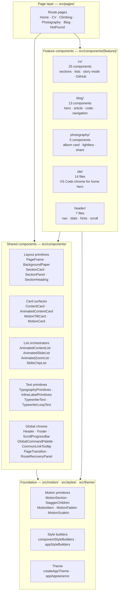
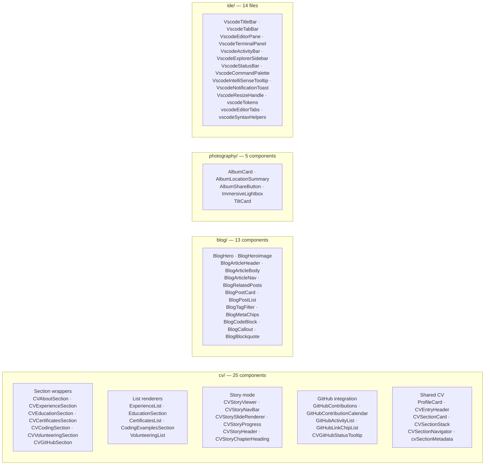
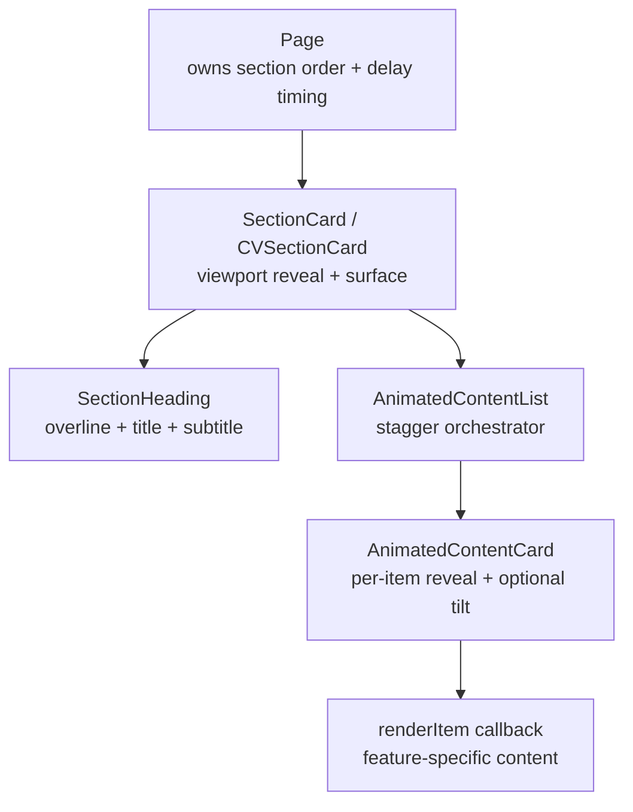
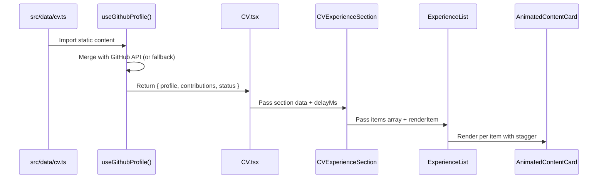

# Component Architecture

This document explains how the component layer is organized: what is shared, what is feature-specific, how composition works, and where new components should go.

For the concrete catalog of existing surfaces, text primitives, and selection guidance, see the [Design system reference](../design-system-reference.md).

## Component layering

## Shared primitives vs feature components

### Shared primitives (`src/components/` + `src/components/layout/` + `src/components/text/`)

These are reusable across multiple routes. They define the site's shared visual language:

| Primitive               | Purpose                                                             | Consumers                                                          |
| ----------------------- | ------------------------------------------------------------------- | ------------------------------------------------------------------ |
| `PageFrame`             | Route-level scaffold with background image and responsive container | Blog, BlogPost, CV, Climbing, Photography, PhotographyCategory     |
| `BackgroundPaper`       | Full-bleed scenic backdrop with optional shell overlay              | Home, NotFound, also used internally by PageFrame                  |
| `SectionCard`           | Viewport-triggered reveal card for content sections                 | Blog, Climbing, Photography, PhotographyCategory                   |
| `CVSectionCard`         | Extended section card with CV-specific surface treatment            | All CV section wrappers                                            |
| `SectionPanel`          | Flat inset panel for nested dense data                              | ClimbingAnalytics, CVGitHubSection, AnimatedContentList panel mode |
| `SectionHeading`        | Overline + title + subtitle composition                             | Blog, Photography, Climbing, CV sections                           |
| `ContentCard`           | Base frosted card surface (no animation)                            | BlogHero, BlogPostCard, GitHub sections                            |
| `AnimatedContentCard`   | Viewport-triggered fade-in card with optional tilt                  | CV repeated-card lists (via AnimatedContentList)                   |
| `AnimatedContentList`   | Staggered card list orchestrator                                    | 5 CV list renderers                                                |
| `AnimatedSlideList`     | Direction-aware slide reveal for tab/accordion content              | CV tab panels                                                      |
| `AnimatedZoomList`      | Zoom-in stagger list                                                | Supplemental lists                                                 |
| `SkillsChipList`        | Skill/tool chip wrap list                                           | CV about, experience, education, coding, story slides              |
| `TabPanel`              | Collapsible tab panel wrapper                                       | CV experience, education, coding, volunteering                     |
| `TypographyPrimitives`  | Semantic text components (HeaderLabel, EntryTitle, BodyText, etc.)  | Site-wide                                                          |
| `InlineLabelPrimitives` | Span-based label components for chips/tabs                          | AppSpeedDial, TabPanel, SkillsChipList                             |

### Feature components (`src/components/{feature}/`)

These belong to a specific route or feature area. They compose shared primitives but add domain-specific logic:

## Intentional design-system exceptions

Four subsystems intentionally bypass the shared design-system primitives. These are not drift — they are purpose-built alternative design languages:

| Subsystem                        | Components                                               | Why it differs                                                                                                                                                                        |
| -------------------------------- | -------------------------------------------------------- | ------------------------------------------------------------------------------------------------------------------------------------------------------------------------------------- |
| **Home faux-VS Code hero**       | `TerminalHeroContent` + `src/components/ide/*`           | Simulates a desktop IDE chrome; uses its own token file (`vscodeTokens.ts`), custom window controls, and terminal typewriter — none of this belongs in the shared card/section system |
| **Blog editorial surfaces**      | `BlogHero`, `BlogArticleBody`, `BlogArticleHeader`       | Uses display-scale typography, image-first hero treatment, and custom content block rendering that doesn't fit the standard `SectionCard` + `SectionHeading` pattern                  |
| **Photography overlay/lightbox** | `ImmersiveLightbox`, `AlbumCard`, `PhotoAlbum`           | Image-first surfaces with full-bleed overlays, quilted layouts, and download/share actions — intentionally not wrapped in standard card surfaces                                      |
| **CV story mode**                | `CVStoryViewer`, `CVStorySlideRenderer`, `CVStoryNavBar` | Full-screen immersive slide experience with directional enter/exit animations, progress bar, and cinematic variants                                                                   |

**Rule:** Do not attempt to "normalize" these into the shared primitive system. They exist for a reason.

## Composition patterns

### Pages compose; components render

Pages are declarative assemblers. They:

- Import data via hooks
- Arrange sections using layout primitives
- Pass data down as props
- Own orchestration timing (section delays, stagger offsets)

Components are reusable renderers. They:

- Accept data via props
- Handle their own presentation and interaction state (tabs, accordions, hover)
- Do not fetch data or own routing concerns
- Do not contain page-level orchestration logic

### Card composition chain

The most common composition pattern for content sections:

### Animated list variants

| Component             | Trigger                        | Animation                   | Use case                       |
| --------------------- | ------------------------------ | --------------------------- | ------------------------------ |
| `AnimatedContentList` | Viewport intersection per card | Zoom-in with optional tilt  | CV repeated sections           |
| `AnimatedSlideList`   | Boolean `in` prop              | Slide-up with stagger       | Tab/accordion expanded content |
| `AnimatedZoomList`    | Boolean `in` prop              | Scale-in with stagger delay | Supplemental reveal lists      |

### Hook → page → component data flow

## Component ownership boundaries

### What shared components should NOT do

- Fetch data or call hooks that fetch data
- Know about specific routes or route parameters
- Own page-level orchestration timing
- Contain page-specific business logic
- Hardcode content strings

### What feature components CAN do

- Compose shared primitives with domain-specific props
- Own feature-specific interaction state (tab selection, drawer toggle)
- Define feature-specific rendering logic (e.g., how a CV entry's detail panel works)
- Import from their own data hooks

### What pages should do

- Wire up data hooks
- Declare section ordering and delay timing
- Compose feature sections into the page scaffold
- Own page-specific state (filters, search, expanded mode)

## Safe extension points

### Adding a new shared component

1. Check the [Design system reference](../design-system-reference.md) first — the pattern you need may already exist
2. Place it in `src/components/` (top-level) or `src/components/layout/` (layout primitive)
3. Accept controlled props; avoid internal state unless it's presentation-only (hover, focus)
4. Use existing motion primitives from `src/motion/components.tsx` for animation — do not create parallel wrappers
5. Use typography primitives from `src/components/text/` — do not style raw `Typography` for standard roles
6. Style via the existing style builder system or inline `sx` from theme tokens

### Adding a new feature component

1. Place it in `src/components/{feature}/` alongside related components
2. Compose shared primitives (cards, lists, headings) as the rendering surface
3. Keep orchestration logic in the consuming page, not in the feature component
4. If the component needs motion, wrap with an existing motion primitive — do not define new variants inline

### Adding a new page

1. Create the page in `src/pages/`
2. Add route metadata to `src/constants/siteRoutes.ts`
3. Add the `<Route>` in `App.tsx`
4. Use `PageFrame` as the scaffold unless the page needs full-bleed treatment (then use `BackgroundPaper`)
5. Compose sections from shared layout primitives (`SectionCard`, `SectionHeading`)
6. Wire data through a hook in `src/hooks/`
7. Follow existing motion patterns — viewport-triggered reveals with stagger timing

## Further reading

- [Design system reference](../design-system-reference.md) — concrete catalog of surfaces, text primitives, and selection guide
- [Motion architecture](../frontend/motion-architecture.md) — how animation primitives compose with components
- [Page choreography](../frontend/page-choreography.md) — how pages assemble and sequence their sections
- [Agent guide](../engineering/agent-guide.md) — operational rules for safe component extension
