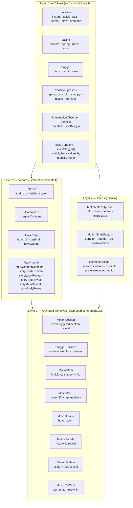
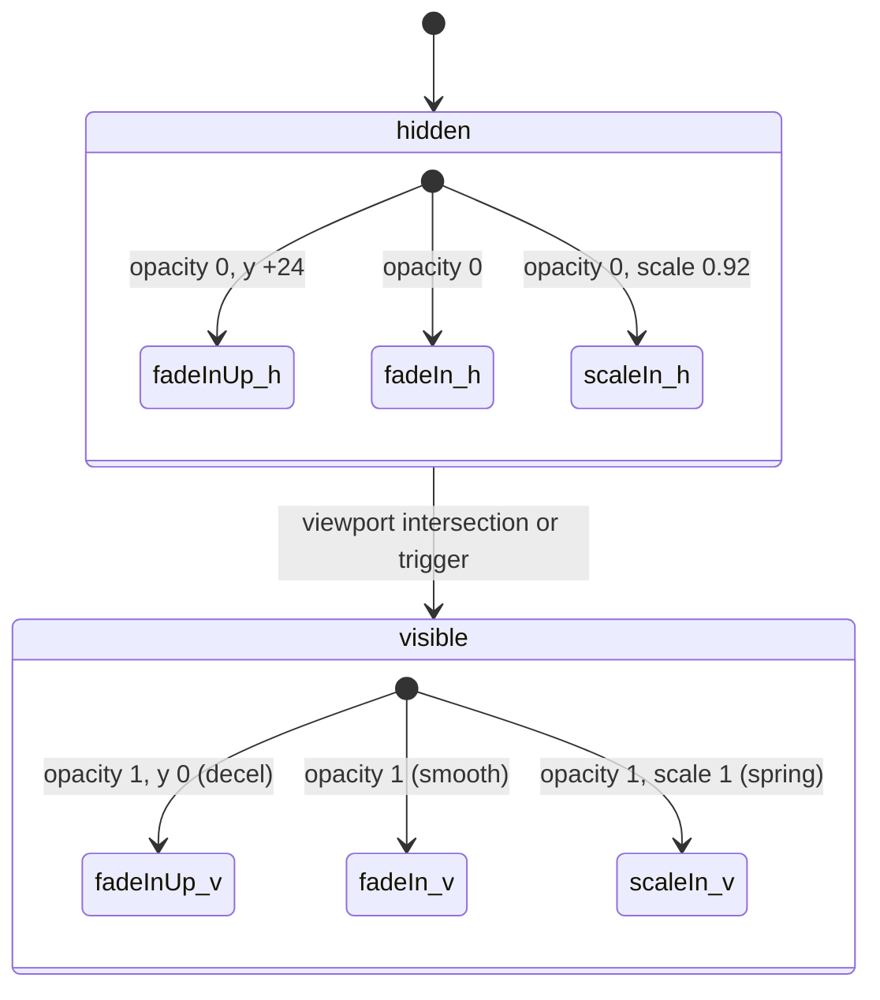
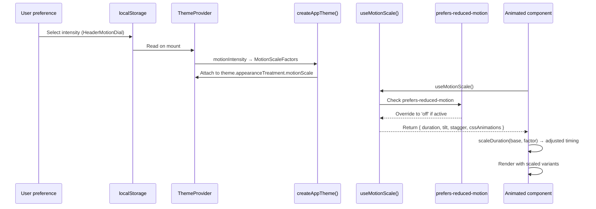
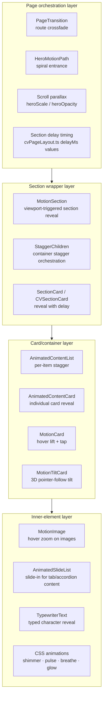
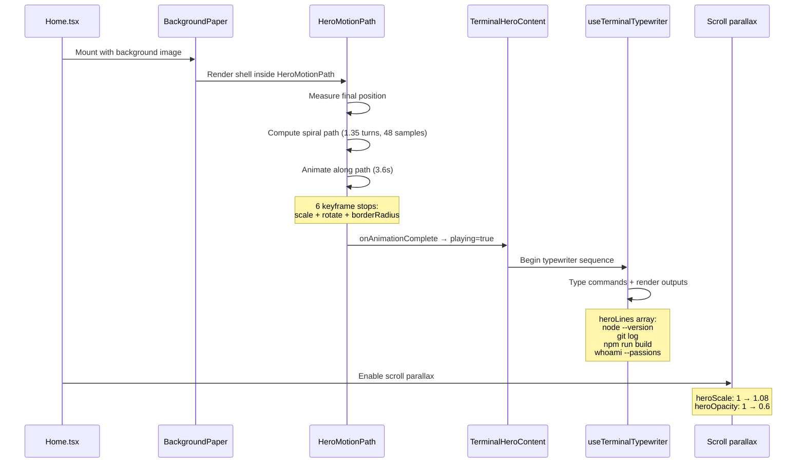
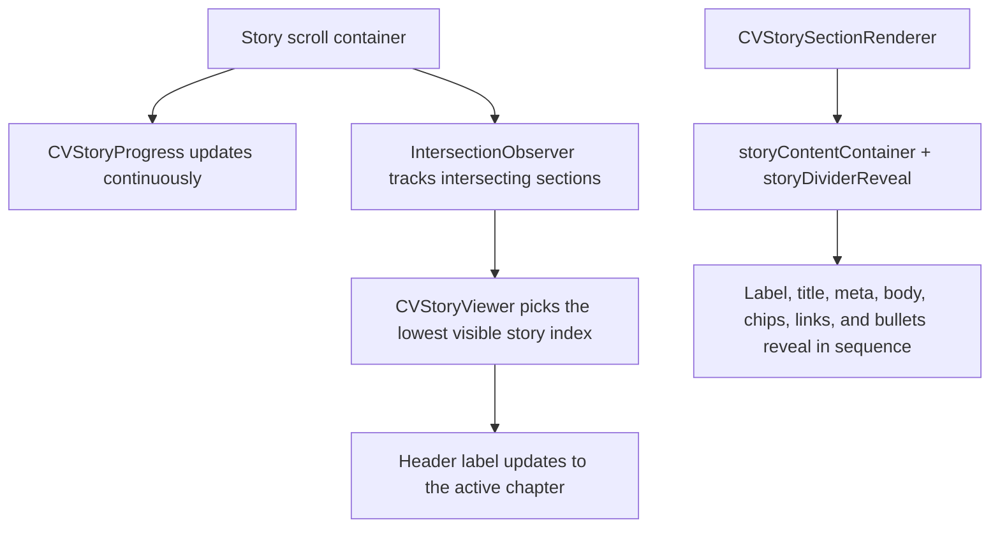

# Motion Architecture

Motion is a first-class architectural layer in this codebase. All animation — from route transitions to card hovers to page entrance choreography — flows through a unified foundation of tokens, variants, components, and a global intensity scaling system.

This document covers the full motion pipeline: what the layers are, how they compose, how intensity scaling works, and where motion logic should live.

## Motion system overview



## Token layer

`src/motion/tokens.ts` defines the raw numeric vocabulary for all animation timing.

### Duration tokens (seconds)

| Token      | Value | Use                                    |
| ---------- | ----- | -------------------------------------- |
| `instant`  | 0.12  | Hover states, button presses           |
| `quick`    | 0.18  | CSS micro-transitions, route crossfade |
| `fast`     | 0.2   | Toggles, small reveals                 |
| `normal`   | 0.35  | Default card transitions               |
| `slow`     | 0.5   | Section entrances, larger reveals      |
| `dramatic` | 0.7   | Page-level choreography                |

Also exported as `cssDuration` (string format: `'0.35s'`) for use in MUI `sx` props and CSS transitions.

### Easing curves

| Curve    | Definition                    | Use                                                    |
| -------- | ----------------------------- | ------------------------------------------------------ |
| `smooth` | `[0.25, 0.1, 0.25, 1]`        | Standard ease-out                                      |
| `spring` | `[0.175, 0.885, 0.32, 1.275]` | Overshoot-and-settle (shared with `SPRING_EASING_CSS`) |
| `decel`  | `[0, 0, 0.2, 1]`              | Incoming content deceleration                          |
| `accel`  | `[0.4, 0, 1, 1]`              | Exiting content acceleration                           |

### Stagger delays (seconds)

| Token    | Value | Use                             |
| -------- | ----- | ------------------------------- |
| `fast`   | 0.04  | Tight stagger for related items |
| `normal` | 0.08  | Default card grids              |
| `slow`   | 0.12  | Large sections                  |

### Transition presets

Pre-composed `{ duration, ease }` objects: `spring`, `smooth`, `snappy`, `reveal`, `dramatic`.

### Scaling helpers

```
scaleDuration(base, factor) → base * factor  (returns 0 when factor is 0)
scaleStagger(base, factor)  → base * factor
```

These are the core mechanism for intensity scaling — every animated primitive calls them before applying timing values.

## Variant layer

`src/motion/variants.ts` defines reusable Framer Motion variant objects. These are the animation "recipes" that components reference:

### Element-level entrance variants



- `fadeInUp` — workhorse entrance: slide up 24px + fade, deceleration easing
- `fadeIn` — pure fade, no transform
- `scaleIn` — scale from 92% + fade, spring easing

### Container orchestration variant

`staggerContainer` defines `staggerChildren: 0.08s` and `delayChildren: 0.04s`. Used by `StaggerChildren` to sequence child animations.

### Hover/tap micro-interactions

| Variant     | Effect                                   |
| ----------- | ---------------------------------------- |
| `hoverLift` | scale 1.02, y -4px — card lifts on hover |
| `tapShrink` | scale 0.98 — press feedback              |
| `hoverZoom` | scale 1.05 — gallery image zoom          |

### CV story mode variants

Continuous-scroll section reveals for the immersive story viewer:

- `storyContentContainer` — section container reveal for each story chapter as it enters the viewport
- `storyDividerReveal` — subtle divider reveal between chapter transitions
- Per-element reveals: `storyLabelReveal`, `storyTitleReveal`, `storyMetaReveal`, `storyBodyReveal`, `storyChipsReveal`, `storyLinkReveal`, and `storyBulletItem`

## Animated primitive layer

`src/motion/components.tsx` exports eight ready-to-use React components. Each:

- Reads the current motion intensity via `useMotionScale()`
- Scales variant timings before applying them
- Falls back to instant rendering when the duration factor is 0

### Component catalog

| Component         | Trigger               | Animation                           | Key behavior                                                         |
| ----------------- | --------------------- | ----------------------------------- | -------------------------------------------------------------------- |
| `MotionSection`   | Viewport intersection | `fadeInUp` (customizable)           | Renders plain `<div>` when motion is off; `once=true` by default     |
| `StaggerChildren` | Viewport intersection | `staggerContainer` + children       | Scales both duration and stagger factors independently               |
| `MotionItem`      | Parent stagger timing | `fadeInUp` (customizable)           | Used inside `StaggerChildren`; inherits hidden/visible from parent   |
| `MotionCard`      | Hover/tap             | `hoverLift` + `tapShrink`           | Suppressed when duration factor is 0                                 |
| `MotionImage`     | Hover                 | `hoverZoom`                         | Expects parent `overflow: hidden`                                    |
| `MotionFadeIn`    | Viewport intersection | `fadeIn`                            | Fade-only variant of `MotionSection`                                 |
| `MotionScaleIn`   | Viewport intersection | `scaleIn`                           | Scale + fade variant of `MotionSection`                              |
| `MotionTiltCard`  | Pointer position      | 3D rotateX/rotateY (spring physics) | Intensity scaled by `tiltFactor`; fully suppressed by reduced-motion |

### IntersectionObserver integration

Scroll-triggered components (`MotionSection`, `StaggerChildren`, `MotionFadeIn`, `MotionScaleIn`) use `useInView` from Framer Motion:

- Default `rootMargin: '0px 0px -10% 0px'` — triggers slightly before the element enters the viewport
- `once: true` — plays the animation only on first appearance
- When `dFactor === 0`, viewport observation is skipped and the element renders immediately

## Intensity scaling system

### The four intensity levels

```mermaid
stateDiagram-v2
  [*] --> Off: duration 0 · tilt 0 · stagger 0 · CSS off
  [*] --> Subtle: duration 0.5× · tilt 0.3× · stagger 0.5× · CSS off
  [*] --> Default: duration 1× · tilt 1× · stagger 1× · CSS on
  [*] --> Expressive: duration 1.3× · tilt 1.2× · stagger 1.3× · CSS on

  Off --> [*]: Instant rendering
  Subtle --> [*]: Muted motion
  Default --> [*]: Full motion
  Expressive --> [*]: Amplified motion
```

| Level        | Duration factor | Tilt factor | Stagger factor | CSS animations |
| ------------ | --------------- | ----------- | -------------- | -------------- |
| `off`        | 0               | 0           | 0              | disabled       |
| `subtle`     | 0.5             | 0.3         | 0.5            | disabled       |
| `default`    | 1.0             | 1.0         | 1.0            | enabled        |
| `expressive` | 1.3             | 1.2         | 1.3            | enabled        |

### Scaling pipeline



**Critical rule:** `prefers-reduced-motion` always wins. Even if the user selects `'expressive'`, the OS-level accessibility preference forces the `'off'` scale factors. This happens inside `useMotionScale()` and cannot be bypassed.

### What `cssAnimations: false` disables

When the motion level is `off` or `subtle`:

- Shimmer sweep on tab hover
- Pill pulse glow overlays
- Chip wave background animations
- Border glow animations
- Section border sweep animations
- Bottom glow animations
- Status bar breathe animations
- Heading breathe animations

These are CSS-only decorative animations defined in `src/styles/animations.ts` and conditionally applied via the `AppMotionTreatment` flags in the resolved theme treatment.

## Motion ownership by layer

Where different kinds of motion should live — and where they should not:



### Rules

| Layer                  | Owns                                                                                   | Does not own                                   |
| ---------------------- | -------------------------------------------------------------------------------------- | ---------------------------------------------- |
| **Page orchestration** | Route transitions, hero entrance paths, scroll-linked parallax, section ordering/delay | Card-level hover, component-internal animation |
| **Section wrapper**    | Viewport-triggered section reveals, stagger container timing                           | Individual item animation, data-driven delays  |
| **Card/container**     | Per-item reveal timing, hover/tap feedback, tilt interactions                          | Page-level sequencing, route transitions       |
| **Inner element**      | Content-level micro-animations (typewriter, image hover, CSS decorative)               | Anything structural                            |

## Home hero entrance choreography

The home page has the most complex motion sequence in the site:



### HeroMotionPath detail

- Measures the shell element's final resting position on screen
- Computes a transform offset to place it at viewport center
- Builds a parametric spiral path: 1.35 turns, exponential radius falloff (1.15), 48 samples
- Animates for 3.6 seconds with a 0.08 hold fraction at the start (while inner "zoom" plays)
- Six interpolated keyframe stops control scale (0.85–1.1), rotation (-8°–10°), and border-radius
- Signals completion via `onAnimationComplete` callback

## CV story mode motion

The story viewer now uses scroll-driven chapter tracking instead of directional slide swaps:



Within each section, content reveals with stagger:

1. Label reveal (x -30 → 0)
2. Title reveal (scale 0.92, blur 6px → clear)
3. Meta reveal (x +20 → 0)
4. Body text reveal (y +12 → 0)
5. Chips reveal (scale 0.9 → 1)
6. Links reveal (y +8 → 0)
7. Bullet list stagger (x -16 → 0, 60ms between items)

## Anti-patterns

### Do not stack competing motion systems

Wrong:

```tsx
<MotionSection>
  <AnimatedContentCard> {/* double viewport trigger */}
    <MotionCard> {/* triple animation on same surface */}
```

Right: choose one entrance mechanism and one hover mechanism per surface.

### Do not duplicate transition primitives

Wrong: defining a new `fadeInUp` variant inline in a component when `src/motion/variants.ts` already exports one.

Right: import from `src/motion/variants.ts` and customize via `variants` prop if needed.

### Do not mix orchestration concerns into low-level components

Wrong: a reusable `ContentCard` that internally decides its own stagger delay based on sibling count.

Right: the parent list component (`AnimatedContentList`) owns stagger timing; the card accepts `delayMs` as a prop.

### Do not add one-off animation logic that breaks the shared motion language

Wrong: a new component that uses `framer-motion` directly with hardcoded duration/easing values instead of tokens.

Right: use `duration`, `easing`, and `transition` from `src/motion/tokens.ts`.

### Do not ignore intensity scaling

Wrong: a new animated component that looks great at `default` but ignores `useMotionScale()`, breaking the `off` and `subtle` levels.

Right: every animated component must call `useMotionScale()` and apply `scaleDuration()` to its timing values.

## Extending the motion system

### Adding a new animated component

1. Import tokens from `src/motion/tokens.ts`
2. Import or define variants in `src/motion/variants.ts`
3. Call `useMotionScale()` and apply `scaleDuration()` / `scaleStagger()` to all timing values
4. When `dFactor === 0`, render without animation (return plain elements or set `initial={false}`)
5. For viewport-triggered animation, use `useInView` with the standard `rootMargin` defaults

### Adding a new variant

1. Define it in `src/motion/variants.ts` using existing tokens for duration and easing
2. Export it as a named constant
3. Reference it from components via the `variants` prop

### Adding CSS-only decorative animation

1. Define the keyframe in `src/styles/animations.ts`
2. Add a corresponding enable flag and duration in the `AppMotionTreatment` type
3. Conditionally apply the animation based on the treatment flag (so it respects `cssAnimations: false`)

## Further reading

- [Page choreography](page-choreography.md) — route-by-route motion sequencing
- [Theme and styling](theme-and-styling.md) — how motion treatment tokens flow through the theme
- [Component architecture](component-architecture.md) — how motion primitives compose with UI components
- [Design system reference](../design-system-reference.md) — motion wrappers in the selection guide
