# Page Choreography

This document explains how each major route is assembled, what motion sequencing it uses, and where page-level orchestration versus shared component concerns live.

For the motion primitive catalog, see [Motion architecture](motion-architecture.md). For the component layer, see [Component architecture](component-architecture.md).

## Route assembly overview

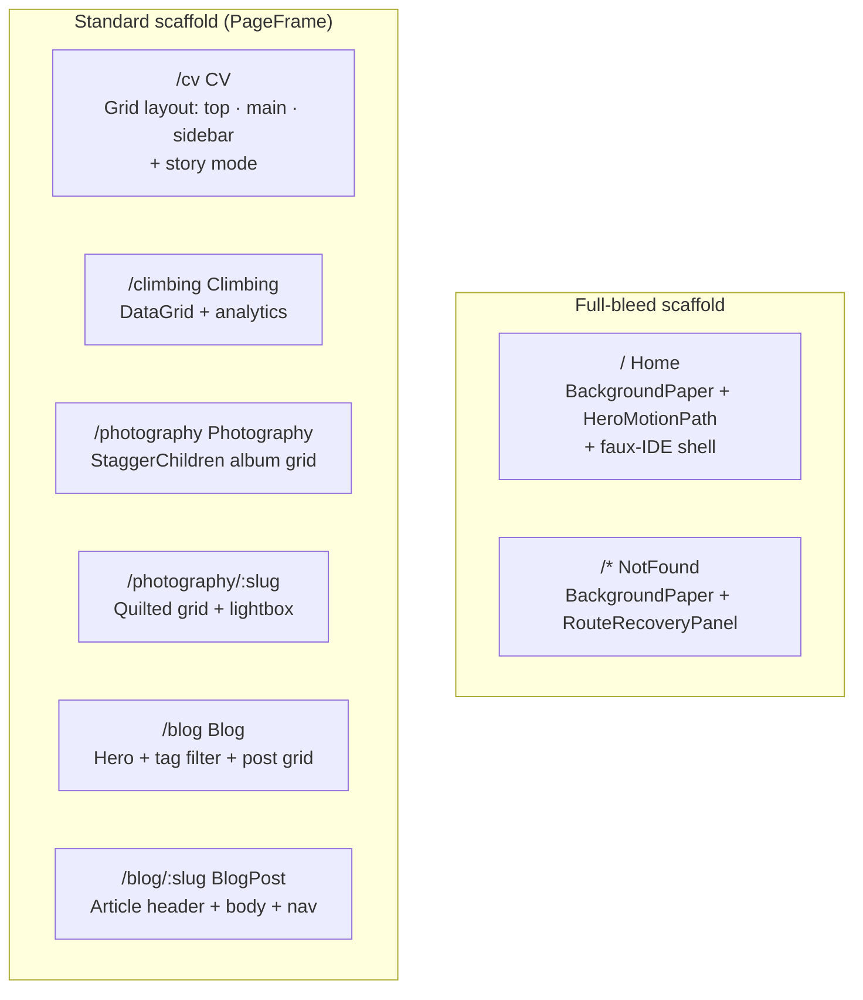

## Home (`/`)

The home page is the most orchestration-heavy route. It renders a faux-VS Code IDE as an interactive hero element.

### Assembly

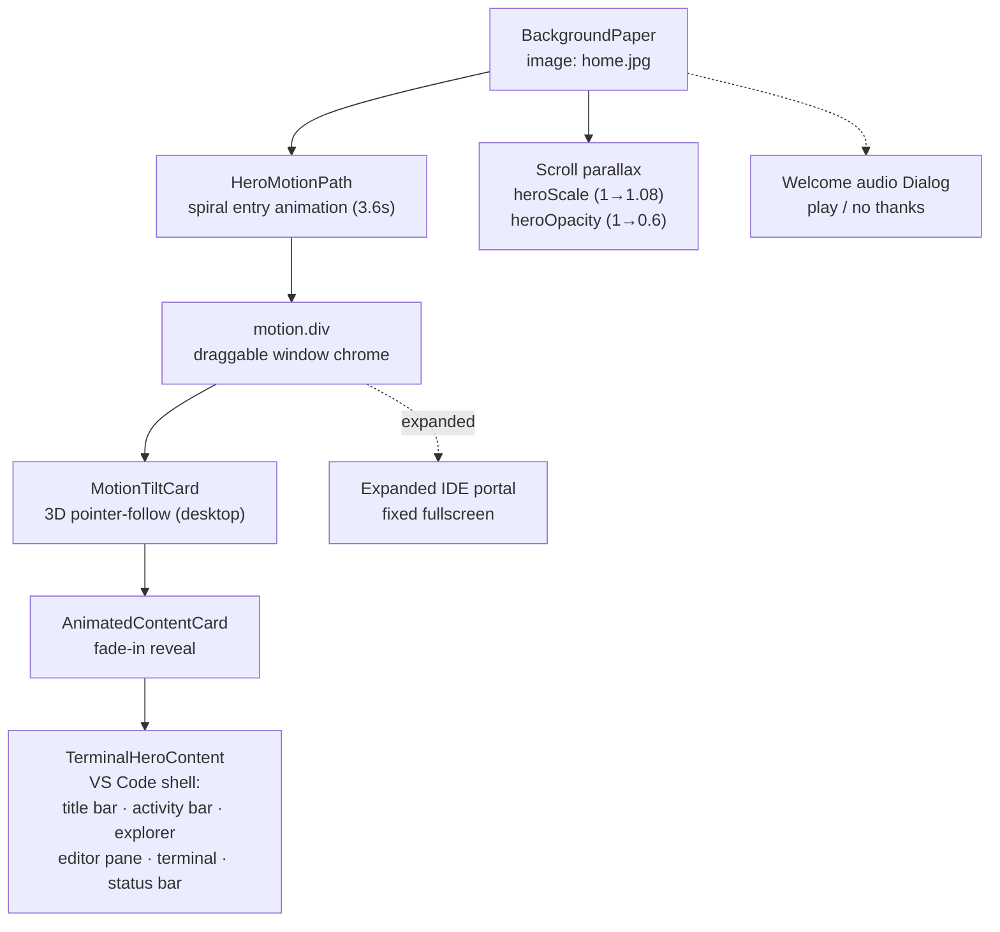

### Entrance sequence

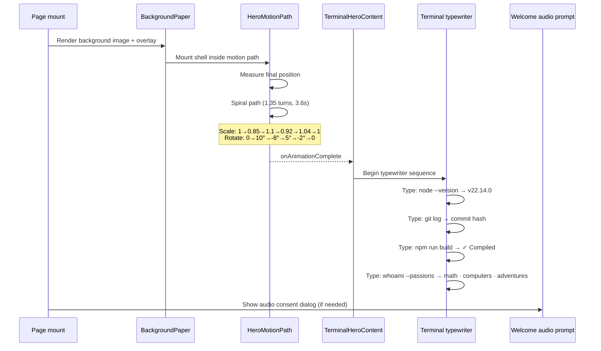

### Page-owned state

| State              | Purpose                                            |
| ------------------ | -------------------------------------------------- |
| `ideWindowState`   | normal / minimized / expanded                      |
| `ideWindowSize`    | width × height for resize                          |
| Drag constraints   | Bound to hero container via `heroBoundsRef`        |
| Typewriter playing | Triggered by `HeroMotionPath` completion           |
| Scroll transforms  | `heroScale` and `heroOpacity` from scroll progress |
| Welcome sequence   | Managed by `useHomeWelcomeSequence()` hook         |

### IDE window interactions

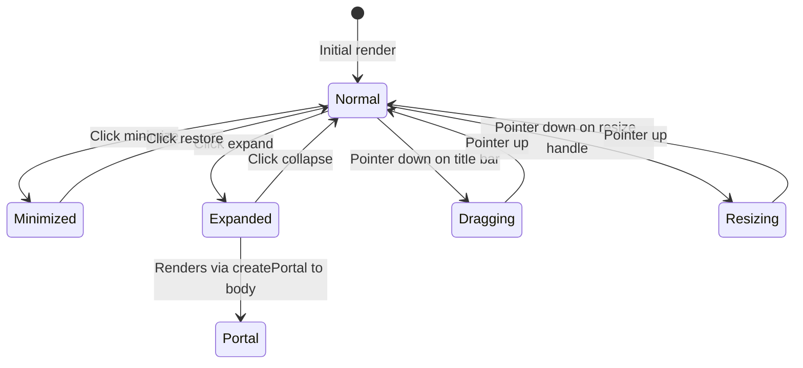

## CV (`/cv`)

The CV page has two modes: a default grid layout and an immersive story viewer.

### Default mode — assembly

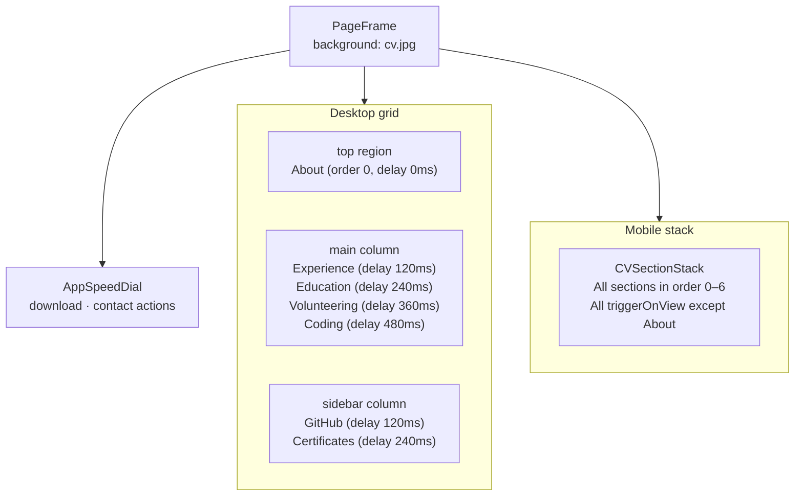

### Section layout metadata

`src/pages/cvPageLayout.ts` defines per-section placement and motion timing:

| Section      | Desktop region | Desktop delay | Desktop triggerOnView | Mobile order |
| ------------ | -------------- | ------------- | --------------------- | ------------ |
| about        | top            | 0ms           | false (immediate)     | 0            |
| experience   | main           | 120ms         | true                  | 1            |
| education    | main           | 240ms         | true                  | 2            |
| volunteering | main           | 360ms         | true                  | 3            |
| github       | sidebar        | 120ms         | true                  | 4            |
| certificates | sidebar        | 240ms         | true                  | 5            |
| coding       | main           | 480ms         | true                  | 6            |

On mobile, all sections stack vertically with `delayMs: 0` and most use `triggerOnView: true` (viewport-triggered reveal).

### Within each section

Each `CVSection*` component wraps a `CVSectionCard` which contains:

1. `SectionHeading` (overline + title)
2. Feature content (list, profile card, GitHub panel, etc.)
3. Internal `AnimatedContentList` for repeated entries (with per-item stagger)
4. Optional `TabPanel` / `AnimatedSlideList` for expandable detail

### Story mode (`?mode=story`)

Activated via query parameter. Replaces the grid layout with `CVStoryViewer`:

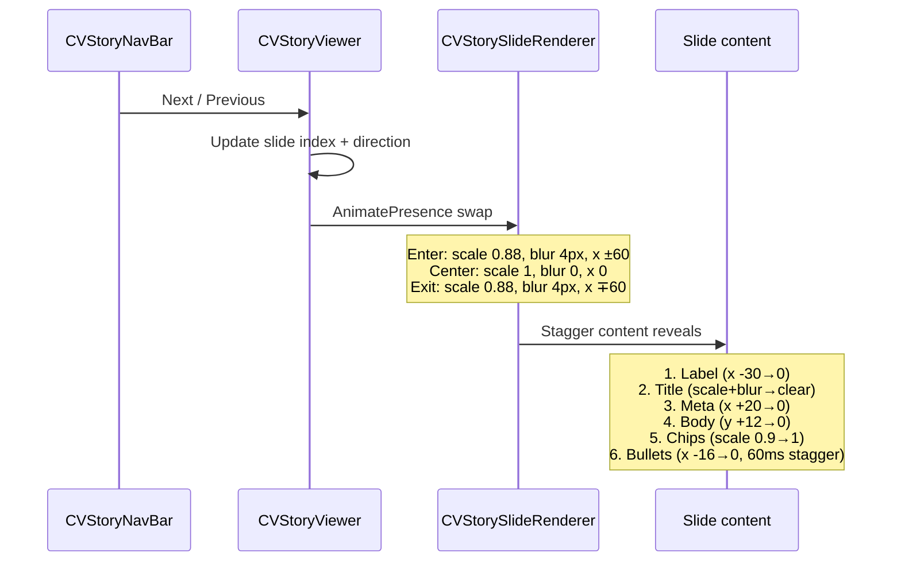

## Climbing (`/climbing`)

### Assembly

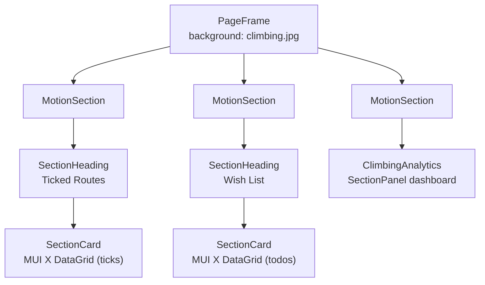

- `useFuzzySearch()` provides route/location filtering across both DataGrid tables
- `MotionSection` wraps each major block for viewport-triggered fade-in-up
- Analytics panels use `SectionPanel` for dense data display

## Photography (`/photography`)

### Assembly

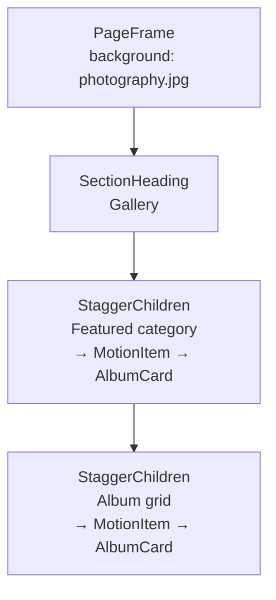

- `AlbumCard` wraps in `MotionTiltCard` on desktop for 3D tilt parallax
- `StaggerChildren` orchestrates sequential reveal across album cards
- Image load state tracked to prevent layout shift during loading

### Category detail (`/photography/:slug`)

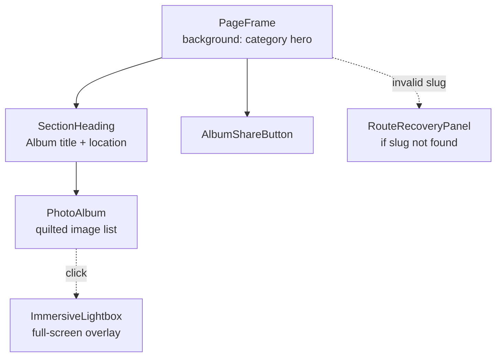

- Quilted layout uses MUI `ImageList` with responsive column counts
- `ImmersiveLightbox` is a full-screen overlay with keyboard navigation, download, and close
- Legacy slug redirects handled in the component for backward compatibility

## Blog (`/blog`)

Feature-gated: only rendered when `isFeatureEnabled('blog')` is true (dev/test builds).

### Assembly

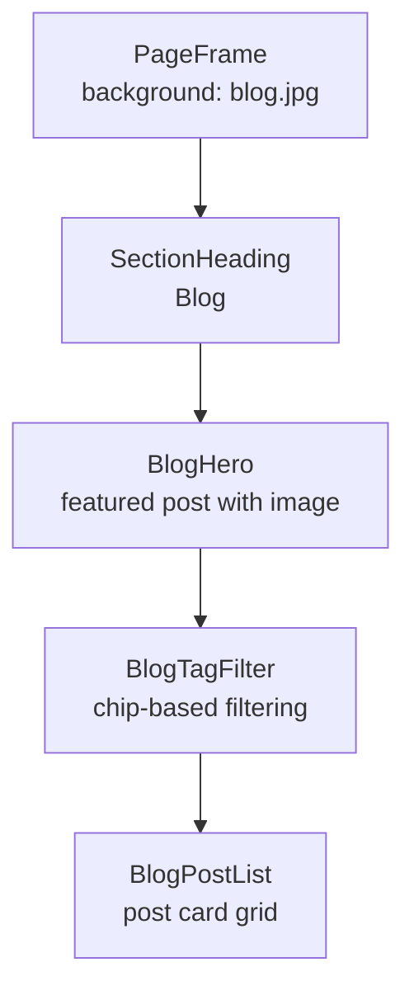

- `BlogHero` uses `ContentCard` with display-scale typography (editorial exception)
- `BlogPostList` renders `BlogPostCard` items in a responsive grid
- Tag filtering is page-local state driven by `useBlogData().tags`

### Post detail (`/blog/:slug`)

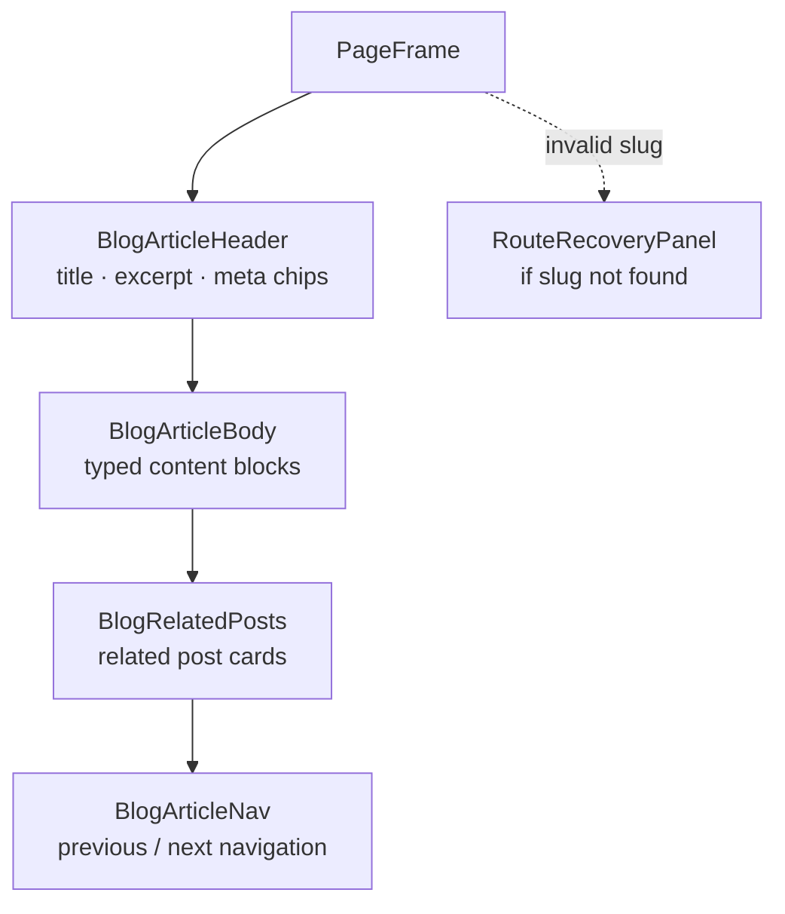

- `BlogArticleBody` renders typed `BlogContentBlock[]`: text, code, image, callout, blockquote
- `BlogCodeBlock` provides syntax highlighting with copy-to-clipboard
- Not-found slugs render `RouteRecoveryPanel` with contextual suggestions

## NotFound (`/*`)

### Assembly

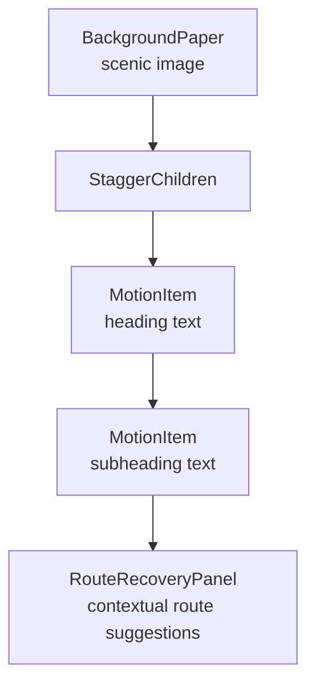

- No `PageFrame` — uses `BackgroundPaper` directly for full-bleed treatment
- `StaggerChildren` + `MotionItem` animate the text reveal
- `RouteRecoveryPanel` provides contextual navigation suggestions based on the attempted path

## Page-level vs component-level concerns

| Concern                           | Belongs at page level           | Belongs in component      |
| --------------------------------- | ------------------------------- | ------------------------- |
| Section ordering and delay timing | ✓                               |                           |
| `delayMs` for each section        | ✓ (via layout metadata)         |                           |
| `triggerOnView` per section       | ✓ (via layout metadata)         |                           |
| Tab/accordion open state          |                                 | ✓ (feature component)     |
| Search/filter state               | ✓ (page-local state)            |                           |
| Stagger timing within a section   |                                 | ✓ (`AnimatedContentList`) |
| Hover/tilt interactions           |                                 | ✓ (motion primitives)     |
| Window drag/resize (Home)         | ✓                               |                           |
| Story mode slide navigation       |                                 | ✓ (`CVStoryViewer`)       |
| Background image selection        | ✓ (passed to `PageFrame`)       |                           |
| SEO metadata                      | ✓ (via `useDocumentMetadata()`) |                           |

## Choreography rules for new pages

1. **Use `PageFrame`** as the scaffold unless the page needs a full-bleed background (then use `BackgroundPaper`)
2. **Wrap sections** in `MotionSection` or `SectionCard` for viewport-triggered reveals
3. **Define section delays** in a layout metadata object (not inline) if the page has multiple sections with staggered timing
4. **Let shared components handle their internal animation** — don't override stagger timing from the page
5. **Use `SectionHeading`** for section intros — don't build custom title stacks
6. **Keep page-level state minimal** — filters, search, expanded mode — and pass data down as props
7. **Follow the data flow**: hook → page → section component → list → card

## Further reading

- [Motion architecture](motion-architecture.md) — token system, variants, intensity scaling
- [Component architecture](component-architecture.md) — shared primitives and feature components
- [App architecture](../architecture/app-architecture.md) — route definitions and page composition model
- [Design system reference](../design-system-reference.md) — surface and layout primitive catalog
