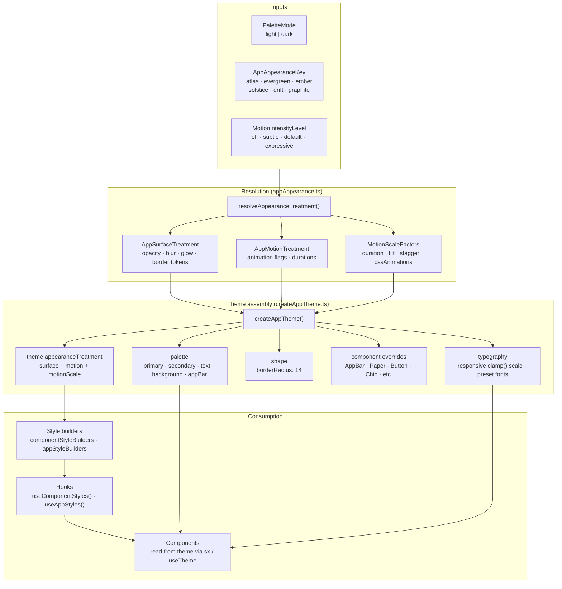
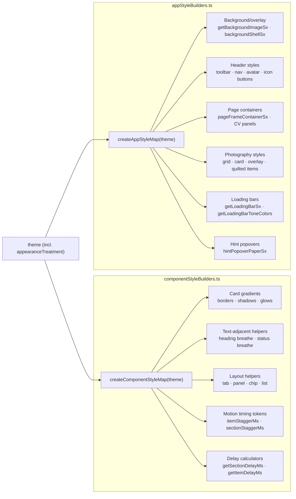

# Theme and Styling

This document covers the MUI theme construction pipeline, the six appearance presets, the style builder system, and where styling decisions should live.

For the concrete catalog of existing UI surfaces and primitives, see the [Design system reference](../design-system-reference.md).

Semantic typography is owned by [src/styles/textStyleBuilders.ts](../../src/styles/textStyleBuilders.ts) and consumed through [src/components/text/Text.tsx](../../src/components/text/Text.tsx). `componentStyleBuilders.ts` does not define canonical text roles; it only supplies surrounding layout, surfaces, and decorative motion helpers.

## Theme construction pipeline



## Appearance presets

Six named presets define the complete visual language for each appearance option:

| Preset        | Personality              | Primary      | Secondary       |
| ------------- | ------------------------ | ------------ | --------------- |
| **atlas**     | Balanced technical       | Teal         | Warm amber      |
| **evergreen** | Calm editorial (default) | Green        | Warm terracotta |
| **ember**     | Richer copper            | Copper       | Cool blue       |
| **solstice**  | Celestial warmth         | Golden amber | Twilight violet |
| **drift**     | Coastal inspiration      | Ocean blue   | Coral           |
| **graphite**  | Refined edge             | Cool slate   | Rose-gold       |

Each preset carries:

```
AppAppearancePreset {
  key, label, shortDescription
  palette      → Record<PaletteMode, AppAppearancePalette>   // full light + dark palettes
  typography   → AppAppearanceTypography                      // body + heading font families
  surface      → Record<PaletteMode, AppSurfaceTreatment>    // opacity, blur, glow tokens
  motion       → AppMotionTreatment                           // CSS animation flags + durations
}
```

The default preset is `evergreen`. Stored in `localStorage` under `'danhenderson-appearance'`.

### Surface treatment tokens

Each preset defines per-mode surface appearance control:

| Token                                                         | What it controls                             |
| ------------------------------------------------------------- | -------------------------------------------- |
| `backgroundOverlayOpacity`                                    | Opacity of the page background image overlay |
| `cardGradientStartAlpha` / `cardGradientEndAlpha`             | Card gradient transparency                   |
| `cardBorderAlpha`                                             | Card border transparency                     |
| `cardShadowAlpha`                                             | Card shadow intensity                        |
| `cardBlurPx`                                                  | Card backdrop blur radius                    |
| `panelSurfaceAlpha` / `panelBorderAlpha`                      | Nested panel transparency                    |
| `glowStrength` / `textGlowStrength` / `secondaryGlowStrength` | Primary and secondary glow intensities       |
| `sectionBottomGlowOpacity`                                    | CV section bottom glow                       |
| `sectionBorderSweepOpacity`                                   | CV section animated border sweep             |
| `accentTintAlpha` / `secondaryTintAlpha`                      | Tint wash overlays                           |

### Motion treatment tokens

CSS-only decorative animation control (distinct from Framer Motion):

| Token                                                | What it controls                    |
| ---------------------------------------------------- | ----------------------------------- |
| `tabHoverShimmerMs`                                  | Shimmer sweep duration on tab hover |
| `pillPulseEnabled` / `pillPulseMs`                   | Glow pulse on pill-shaped chips     |
| `chipWaveEnabled` / `chipWaveMs`                     | Background wave animation on chips  |
| `borderGlowEnabled` / `borderGlowMs`                 | Border glow pulse                   |
| `sectionBorderSweepEnabled` / `sectionBorderSweepMs` | CV section border gradient sweep    |
| `statusBreatheEnabled` / `statusBreatheMs`           | Status text breathing               |
| `headingBreatheEnabled` / `headingBreatheMs`         | Heading text breathing              |

All of these are disabled when `motionIntensity` is `off` or `subtle` (via `cssAnimations: false`).

## MUI theme augmentation

The standard MUI `Theme` interface is augmented in `src/theme/mui.d.ts`:

```typescript
declare module '@mui/material/styles' {
  interface Theme {
    appearanceTreatment: AppResolvedTreatment;
  }
}
```

This makes `theme.appearanceTreatment` available everywhere `useTheme()` is called, carrying:

- `.surface` — resolved `AppSurfaceTreatment` for current mode + preset
- `.motion` — resolved `AppMotionTreatment` for current preset + intensity
- `.motionScale` — `MotionScaleFactors` for current intensity level

## MUI component overrides

`createAppTheme()` sets these global MUI overrides:

| Component                             | Key overrides                                                                    |
| ------------------------------------- | -------------------------------------------------------------------------------- |
| `MuiCssBaseline`                      | Smooth scrolling, font rendering, link colors                                    |
| `MuiAppBar`                           | Backdrop blur, alpha-blended background, subtle bottom border                    |
| `MuiPaper`                            | Border with divider color at 45% alpha                                           |
| `MuiButton`                           | No elevation, pill-shaped (borderRadius 999), outlined uses primary at 50% alpha |
| `MuiChip`                             | Pill-shaped (borderRadius 999)                                                   |
| `MuiSpeedDial` / `MuiSpeedDialAction` | Surface tweaks with backdrop blur                                                |
| `MuiAccordion`                        | Rounded corners, no `::before` pseudo-element                                    |
| `MuiLink`                             | Hover underline                                                                  |

### Typography scale

Typography uses fluid `clamp()` sizing from preset-defined font families:

- `h1`–`h6`: Responsive heading scale with preset heading fonts
- `body1`/`body2`: Preset body fonts with defined sizes and line heights
- `overline`: Themed heading font with increased letter-spacing
- `button`: Weight 600, letter-spacing 0.02em

## Style builder system

Two style builder modules compute theme-aware style objects, then expose them through memoized hooks:



### Consuming style builders

Components consume via hooks that memoize the builder output:

```typescript
// src/styles/componentStyles.ts
export const useComponentStyles = () => {
  const theme = useTheme();
  return useMemo(() => createComponentStyleMap(theme), [theme]);
};

// src/styles/appStyles.ts
export const useAppStyles = () => {
  const theme = useTheme();
  return useMemo(() => createAppStyleMap(theme), [theme]);
};
```

Components use them like:

```tsx
const styles = useComponentStyles();
<Box sx={styles.contentCardSx}>...</Box>;
```

### Key computed surfaces in `componentStyleBuilders`

| Surface                | What it produces                                       |
| ---------------------- | ------------------------------------------------------ |
| `contentCardSx`        | Card background gradient + glow shadow + border + blur |
| `cvSectionCardSx`      | Extended card + bottom glow + border sweep animation   |
| `subtleSurface`        | Panel surface with reduced alpha                       |
| `hoverShimmerSx`       | Tab hover shimmer `::after` pseudo-element             |
| `pillPulseOverlaySx`   | Glow pulse `::after` for pill chips                    |
| `borderGlowOverlaySx`  | Border glow animation                                  |
| `interactiveSurfaceSx` | Button-like hover with shadow                          |

### Key computed surfaces in `appStyleBuilders`

| Surface                  | What it produces                              |
| ------------------------ | --------------------------------------------- |
| `getBackgroundImageSx()` | Full-cover background with `::before` overlay |
| `backgroundShellSx`      | Translucent shell panel on background         |
| `headerToolbarSx`        | Responsive header padding and height          |
| `photographyGridSx`      | Responsive 1/2/3 column grid                  |
| `pageFrameContainerSx`   | Route container padding                       |
| `backToTopFabSx`         | Fixed FAB with blur and shadow                |

### Motion timing tokens in `componentStyleBuilders`

The style builder also exports stagger timing constants, scaled by the current intensity:

| Token                    | Base value | Scaled by        |
| ------------------------ | ---------- | ---------------- |
| `itemStaggerMs`          | 120ms      | `staggerFactor`  |
| `sectionStaggerMs`       | 120ms      | `staggerFactor`  |
| `loadingPulseDurationMs` | 1600ms     | `durationFactor` |
| `loadingBarStaggerMs`    | 200ms      | `staggerFactor`  |

## CSS animation keyframes

`src/styles/animations.ts` defines Emotion keyframes used for decorative CSS animations:

| Keyframe          | Visual effect                            |
| ----------------- | ---------------------------------------- |
| `shimmerSweep`    | Translucent highlight sweep at 90°       |
| `ambientPulse`    | Opacity + scale fade with glow shadow    |
| `backgroundSweep` | Gradient position slide for chips        |
| `breathe`         | Gentle opacity + Y-translate oscillation |
| `loadingPulse`    | Smooth opacity ramp (35% → 100%)         |
| `pulseRing`       | Expanding ring with fade-out             |
| `cursorBlink`     | Step-based on/off for terminal cursor    |

These are conditionally applied based on `AppMotionTreatment` flags, which are disabled when `cssAnimations: false`.

## Spring easing

`src/styles/springEasing.ts` exports the shared spring physics curve:

```
SPRING_EASING_CSS = 'cubic-bezier(0.175, 0.885, 0.32, 1.275)'
SPRING_EASING_MOTION = [0.175, 0.885, 0.32, 1.275]
```

This produces ease-out-back (slight overshoot and settle). It is used across:

- MUI Zoom component easing
- Framer Motion transition presets
- Route transition easing
- `AnimatedContentCard` entrance

## Where styling should live

| Category                    | Where                                                                           | Example                                                 |
| --------------------------- | ------------------------------------------------------------------------------- | ------------------------------------------------------- |
| **Palette colors**          | Appearance preset in `appAppearance.ts`                                         | `primary.main`, `secondary.main`, `background.paper`    |
| **Typography scale**        | `createAppTheme()`                                                              | `h1`–`h6` sizes, body font families                     |
| **Semantic text roles**     | `textStyleBuilders.ts` + `Text.tsx`                                             | `sectionTitle`, `meta`, `inlineLabel`, `proseParagraph` |
| **Component defaults**      | MUI component overrides in `createAppTheme()`                                   | Button shape, chip shape, paper border                  |
| **Surface treatments**      | `componentStyleBuilders.ts` → computed from `theme.appearanceTreatment.surface` | Card gradients, glow shadows, border opacity            |
| **Page-level layout**       | `appStyleBuilders.ts` → consumed via `useAppStyles()`                           | Background overlays, header styling, page containers    |
| **Motion timing**           | `componentStyleBuilders.ts` → exposed as timing tokens                          | Stagger delays, animation durations                     |
| **Component-local styling** | Inline `sx` prop using theme tokens                                             | One-off spacing, conditional visibility                 |

### Where styling should NOT live

| Anti-pattern                                               | Why it's wrong                                             |
| ---------------------------------------------------------- | ---------------------------------------------------------- |
| Hardcoded hex colors in components                         | Breaks theme consistency and appearance preset switching   |
| Custom `Typography` styling for standard text roles        | Bypasses the semantic text primitive system                |
| Ad hoc card insets/spacing not from style builders         | Creates inconsistent spacing that doesn't scale with theme |
| CSS-in-JS style objects defined outside the builder system | Misses theme reactivity and treatment token changes        |
| Motion durations as inline magic numbers                   | Breaks intensity scaling and consistency                   |

## Current inconsistencies

1. **Some components use direct `sx` spacing** where a style builder profile would be more consistent. This is pragmatic for one-off adjustments but should not be extended to new shared surfaces.

2. **The IDE chrome (`src/components/ide/`)** maintains its own token file (`vscodeTokens.ts`) with hardcoded colors outside the theme system. This is intentional — the VS Code simulation needs to look like VS Code, not like the portfolio theme.

3. **Some shared components still carry decorative text-adjacent helpers** from `componentStyleBuilders.ts` such as heading-breathe and status-breathe motion. Those helpers are valid only when they do not redefine the canonical role, tone, or context that already lives in `textStyleBuilders.ts`.

## Further reading

- [Design system reference](../design-system-reference.md) — catalog of surfaces, cards, text primitives, and the selection guide
- [Motion architecture](motion-architecture.md) — how motion treatment tokens feed into animation components
- [Component architecture](component-architecture.md) — how components consume style builders
- [Agent guide](../engineering/agent-guide.md) — styling consistency rules for safe extension
