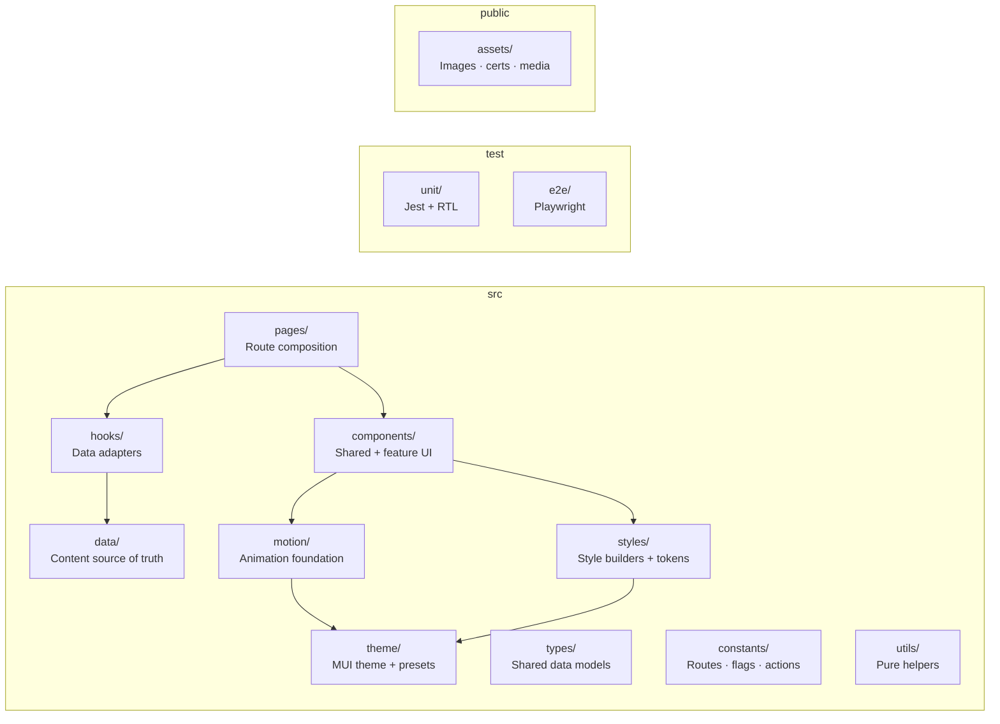

# Project Overview

[danhenderson.dev](https://danhenderson.dev) is a client-side React + TypeScript portfolio site. It is a single-page application built for static hosting, with route-level pages for a CV, climbing log, photography galleries, and a feature-gated blog.

The site is not a template or a starter kit. It is a purpose-built frontend application with deliberate choices around motion choreography, theme-driven visual consistency, and compositional UI architecture.

## What the site does

| Route          | Experience                                                                                                                                                                  |
| -------------- | --------------------------------------------------------------------------------------------------------------------------------------------------------------------------- |
| `/`            | Home page with a faux-VS Code IDE hero — draggable, resizable, expandable — featuring terminal typewriter animation and optional welcome audio                              |
| `/cv`          | Interactive CV with responsive desktop/mobile layout, GitHub-backed highlights with fallback data, tab/accordion detail panels, and an immersive story mode (`?mode=story`) |
| `/climbing`    | Searchable climbing log with MUI X DataGrid, fuzzy filtering, and analytics dashboard                                                                                       |
| `/photography` | Gallery grid with tilt-effect album cards, quilted image layouts, and an immersive full-screen lightbox                                                                     |
| `/blog`        | Editorial blog with hero cards, tag filtering, code blocks, callouts, and post navigation (feature-gated to dev/test builds)                                                |

## What makes the implementation notable

### Motion as architecture

The site treats animation as a first-class architectural concern, not a decorative afterthought. A unified motion system provides:

- **Duration, easing, and stagger tokens** shared across all animated surfaces
- **Framer Motion variant definitions** for consistent entrance, hover, and transition behavior
- **A four-level motion intensity dial** (off → subtle → default → expressive) that globally scales all animation timing, tilt effects, and CSS animations — with automatic `prefers-reduced-motion` override
- **Scroll-triggered viewport reveals** using IntersectionObserver, with per-component motion scaling
- **Page-level entrance choreography** including a parametric spiral motion path on the home hero

See [Motion architecture](../frontend/motion-architecture.md) for full detail.

### Theme-driven appearance system

Six named appearance presets (atlas, evergreen, ember, solstice, drift, graphite) each provide complete dichromatic palettes, font stacks, surface treatments, and motion rules. The theme system resolves a preset + palette mode + motion intensity into a single `AppResolvedTreatment` that every style builder and component reads from `theme.appearanceTreatment`.

See [Theme and styling](../frontend/theme-and-styling.md) for the full pipeline.

### Compositional UI

Pages compose from a layered set of shared primitives:

```
PageFrame / BackgroundPaper        ← route scaffold
  SectionCard / CVSectionCard      ← section surface
    SectionHeading                 ← section intro
      AnimatedContentList          ← repeated items with stagger
        AnimatedContentCard        ← individual reveal with optional tilt
          TypographyPrimitives     ← semantic text
```

Each layer has a defined role and clear ownership. Four intentional subsystems — the Home IDE hero, blog editorial surfaces, photography overlay/lightbox, and CV story mode — bypass the default shared design system by design.

See [Component architecture](../frontend/component-architecture.md) and the [Design system reference](../design-system-reference.md).

## Repository organization



### Key directories

| Directory         | Responsibility                                                                                                              |
| ----------------- | --------------------------------------------------------------------------------------------------------------------------- |
| `src/pages/`      | Route-level page composition — one file per route, declarative assembly of components and hooks                             |
| `src/components/` | Shared UI primitives (cards, lists, text, layout) and feature-specific components (cv/, blog/, photography/, ide/, header/) |
| `src/hooks/`      | Data adapters and route helpers — each hook wraps a data module and provides a stable API to pages                          |
| `src/data/`       | Source-of-truth content modules — CV entries, blog posts, climbing logs, photography metadata                               |
| `src/motion/`     | Unified animation foundation — tokens, easing, variants, and animated React primitives                                      |
| `src/theme/`      | MUI theme assembly, appearance presets, and TypeScript augmentation                                                         |
| `src/styles/`     | Theme-conditioned style maps, Emotion keyframes, and spring easing                                                          |
| `src/constants/`  | Build-time stable config — route definitions, command palette actions, feature flags, recovery context                      |
| `src/types/`      | Centralized data model types shared across data, hooks, components, and pages                                               |
| `src/utils/`      | Pure, framework-agnostic helper functions                                                                                   |
| `test/unit/`      | Jest + React Testing Library — ~125 test files covering providers, hooks, components, pages, and utilities                  |
| `test/e2e/`       | Playwright — route-level browser specs with mocked GitHub API and route readiness helpers                                   |

## Stack

| Concern           | Technology                         |
| ----------------- | ---------------------------------- |
| Framework         | React 18                           |
| Language          | TypeScript                         |
| Routing           | React Router v6                    |
| Component library | MUI (Material UI) + Emotion        |
| Data tables       | MUI X DataGrid                     |
| Animation         | Framer Motion (via `motion/react`) |
| Build tooling     | Create React App (`react-scripts`) |
| Unit testing      | Jest + React Testing Library       |
| E2E testing       | Playwright                         |
| CI runtime        | Node 20                            |

## Further reading

- [App architecture](../architecture/app-architecture.md) — shell, routes, providers, page boundaries
- [Component architecture](../frontend/component-architecture.md) — primitives, feature components, extension points
- [Motion architecture](../frontend/motion-architecture.md) — tokens, variants, choreography, scaling
- [Theme and styling](../frontend/theme-and-styling.md) — presets, palette, style builders
- [Page choreography](../frontend/page-choreography.md) — route-by-route assembly and motion sequencing
- [Design system reference](../design-system-reference.md) — catalog of established patterns
